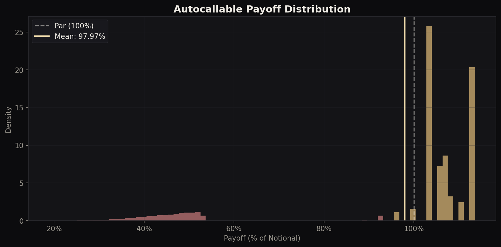
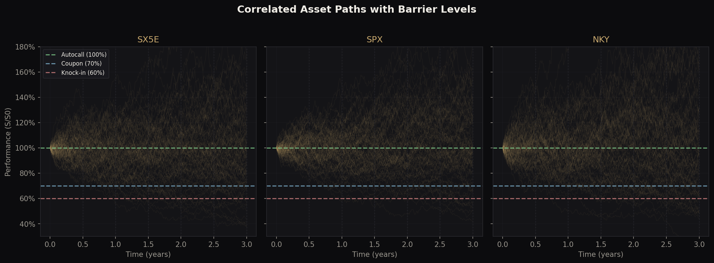
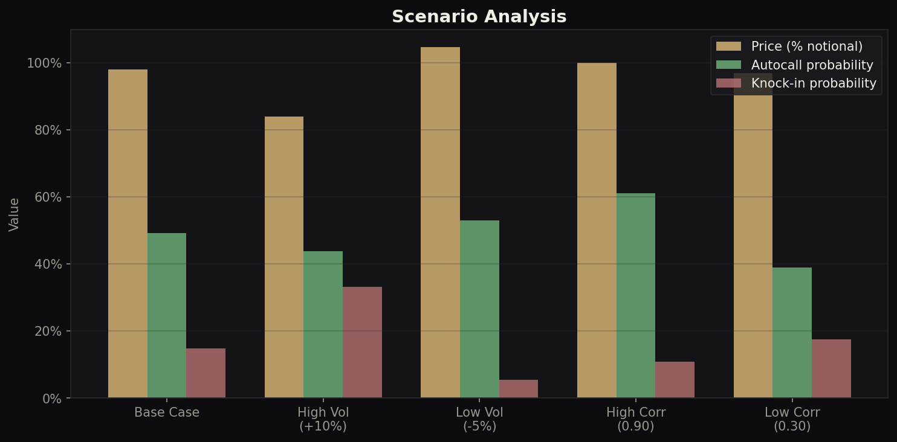
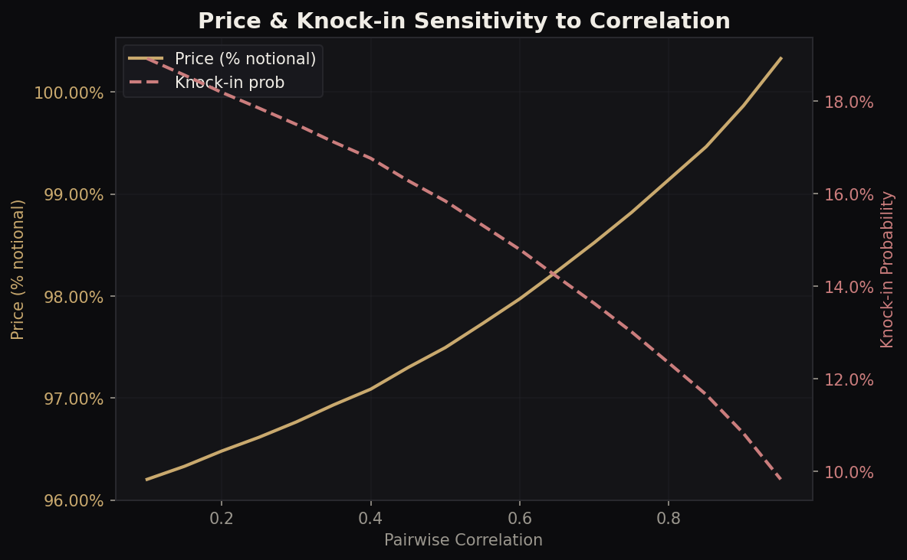
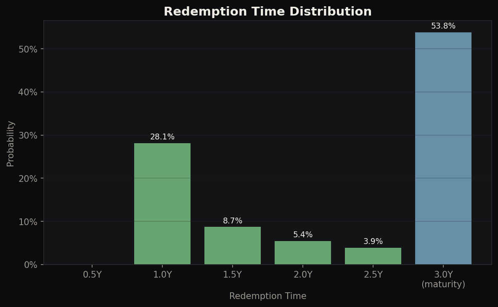

# Autocallable Worst-of Pricing Engine

**Monte Carlo pricer for worst-of autocallable structured notes** with Heston stochastic volatility, Brownian bridge barrier correction, term structures, CVA, and an interactive Streamlit dashboard.

> Author: Philippe-Emmanuel Yao | MSc Financial Mathematics, LSE

---

## Product Structure

A worst-of autocallable note links to **N underlying assets** (typically equity indices). At periodic observation dates:

1. **Autocall**: If the worst-performing asset is above the autocall barrier (e.g. 100%), the note redeems early with accumulated coupons
2. **Coupon**: If the worst performer is above the coupon barrier (e.g. 70%), a coupon is paid (with memory: missed coupons are recovered)
3. **Knock-in**: If the worst performer breaches the knock-in barrier (e.g. 60%), capital protection is lost
4. **At maturity**: If knocked-in, the investor bears the worst-of loss. Otherwise, principal + coupon returned

The pricing challenge: **path-dependent, multi-asset, barrier-driven, correlation-sensitive**.

---

## Architecture

```
autocallable_pricer.py   Core engine: GBM simulation, payoff, Greeks, scenarios
heston_model.py          Extension 1: Heston stochastic volatility
brownian_bridge.py       Extension 2: Continuous barrier correction
term_structure.py        Extension 3: Rate and dividend curves
cva_adjustment.py        Extension 4: Counterparty credit risk (CVA)
dashboard.py             Extension 5: Streamlit interactive dashboard
visualisations.py        Publication-quality charts
```

---

## Base Case Results (200K paths, GBM)

### 3Y Note on SX5E / SPX / NKY

| Metric | Value |
|---|---|
| **Price** | 98.03% of notional |
| **Autocall probability** | 49.1% |
| **Knock-in probability** | 14.7% |
| **Avg redemption time** | 2.23Y |
| **Avg coupon earned** | 15.8% |

### Scenario Analysis

| Scenario | Price | Autocall% | KI% |
|---|---|---|---|
| Base Case | 98.0% | 49.1% | 14.7% |
| High Vol (+10%) | 84.1% | 43.7% | 33.0% |
| Low Vol (-5%) | 104.7% | 52.9% | 5.2% |
| High Corr (0.90) | 99.8% | 61.1% | 10.9% |
| Low Corr (0.30) | 96.8% | 39.0% | 17.4% |

---

## Extension 1: Heston Stochastic Volatility

Replaces flat GBM volatility with per-asset Heston dynamics:

```
dS/S  = (r - q) dt + sqrt(V) dW_S
dV    = kappa*(theta - V) dt + xi * sqrt(V) dW_V
corr(dW_S, dW_V) = rho_sv
```

Each asset has its own Heston process with independent vol-of-vol and spot-vol correlation. Inter-asset correlation applied on spot Brownians via Cholesky. Feller condition validated at initialisation.

**Impact**: Heston prices at 96.12% vs GBM 98.03%. Stochastic vol generates fatter tails and higher knock-in (16.3% vs 14.7%), consistent with negative skew from rho_sv < 0.

## Extension 2: Brownian Bridge Barrier Correction

Discrete monitoring underestimates knock-in probability. The Brownian bridge gives exact conditional probability of breach between observations:

```
P(min S(t) < B | S(t1), S(t2)) = exp(-2 * log(S1/B) * log(S2/B) / (sigma^2 * dt))
```

**Impact**: Continuous KI = 28.85% vs discrete 20.48%. Correction factor of **1.41x**. The discrete approximation underestimates knock-in by ~41%.

## Extension 3: Term Structure of Rates and Dividends

Piecewise-linear interpolated curves replace flat assumptions. Time-dependent drift at each MC step. Includes EUR rate curve and asset-specific dividend curves.

**Impact**: Term structure pricing at 98.87% vs flat 98.03%, reflecting lower average forward rate.

## Extension 4: CVA (Credit Valuation Adjustment)

Counterparty credit risk from CDS-implied hazard rates with EPE profile:

| Rating | CVA (bps) |
|---|---|
| AAA (10bps) | 2.8 |
| A (50bps) | 14.5 |
| BBB (100bps) | 29.2 |
| BB (200bps) | 58.7 |

## Extension 5: Streamlit Dashboard

```bash
streamlit run dashboard.py
```

Interactive dashboard with model selection (GBM/Heston), barrier calibration, Greeks, Brownian bridge comparison, CVA by credit quality, and correlation scan.

---

## Visualisations

### Payoff Distribution


### Correlated Asset Paths with Barriers


### Scenario Analysis


### Correlation Sensitivity


### Redemption Time Distribution


---

## Desk Relevance

- **Equity/FX Structuring**: Product design, coupon calibration, barrier selection
- **Exotics Trading**: Delta-hedging worst-of, correlation risk management
- **Quantitative Analytics**: Model validation (GBM vs Heston), calibration stability
- **Risk Management**: Scenario analysis, tail risk, CVA
- **Model Validation**: Brownian bridge correction quantifies discrete monitoring bias

## Technical Stack

Python, NumPy, SciPy, Matplotlib, Streamlit

## Usage

```bash
python autocallable_pricer.py       # Core pricing + Greeks + scenarios
python heston_model.py              # Heston stochastic vol pricing
python brownian_bridge.py           # Barrier correction analysis
python term_structure.py            # Term structure pricing
python cva_adjustment.py            # CVA computation
python visualisations.py            # Generate all charts
streamlit run dashboard.py          # Interactive dashboard
```
