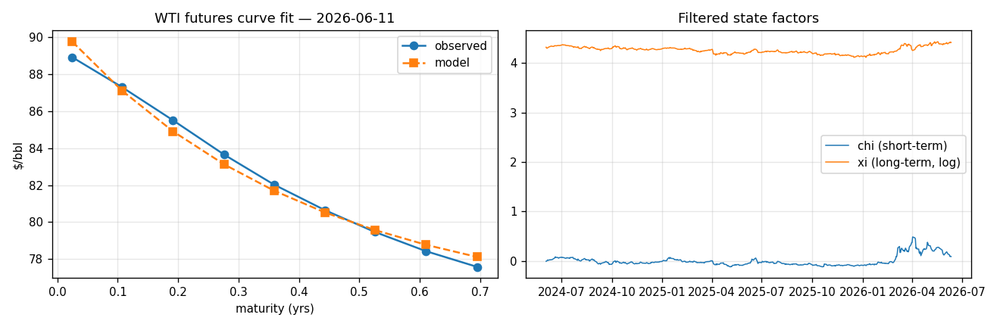
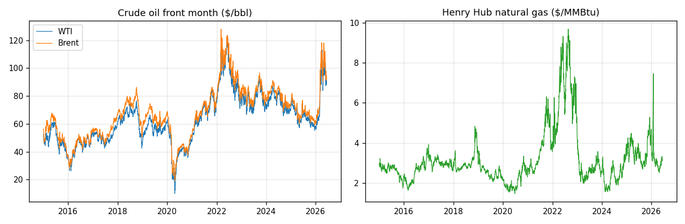
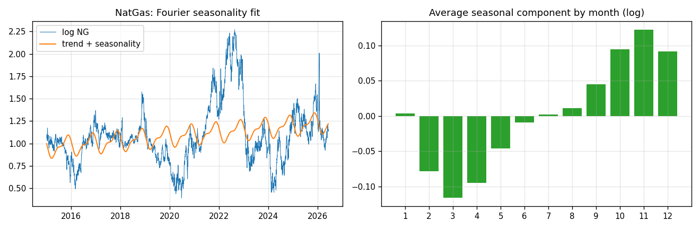
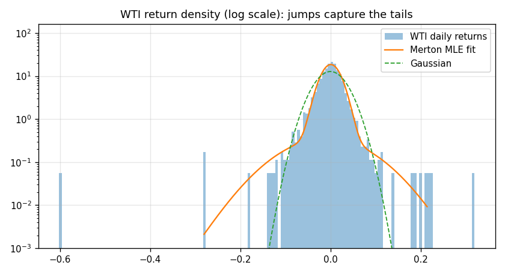
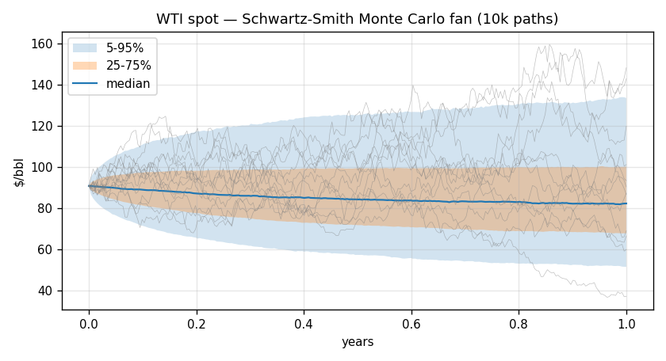
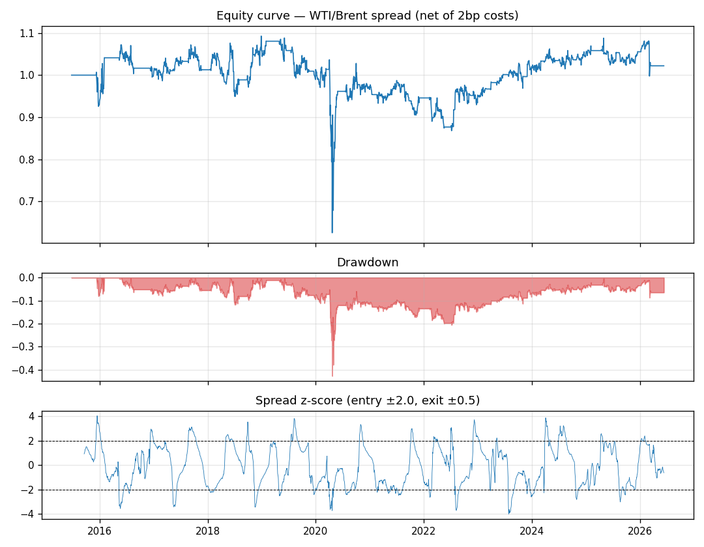
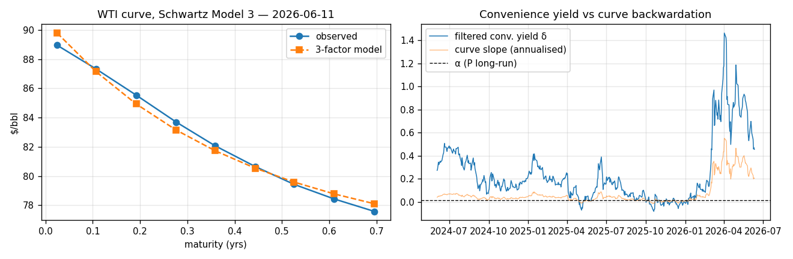
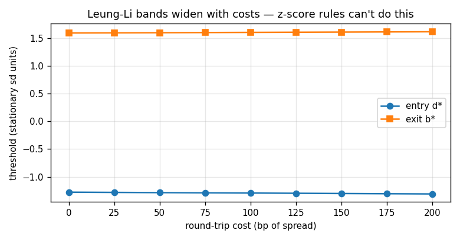
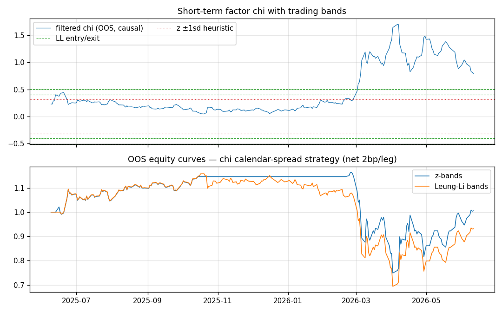

# Commodity Price Modeling & Trading

End-to-end quantitative pipeline for energy commodities (WTI, Brent, Henry Hub natural gas): stochastic price modeling, futures curve calibration via Kalman filtering, Monte Carlo simulation, and a backtested relative-value strategy. All on live market data.



```
pip install -r requirements.txt
python run_pipeline.py        # core pipeline, ~1 min, figures 01-06
python run_extensions.py      # extensions, ~2 min, figures 07-09
```

## What it does

**1. Data layer** (`src/data.py`)
Continuous front-month contracts (WTI, Brent, NG) since 2015, plus a panel of 9 WTI maturities (continuous front + 8 fixed contracts out to ~9 months) with exact time-to-maturity tracking. The negative WTI settlement of 20 April 2020 is bridged, as log-price models are undefined there.



**2. Seasonality** (`src/models/seasonality.py`)
Truncated Fourier series (K=2 harmonics) jointly fitted with a linear trend by OLS on log natural gas. The deseasonalised residual is the input to the stochastic layer — fitting mean reversion on raw seasonal prices biases the speed estimate upward.



**3. Schwartz (1997) one-factor** (`src/models/ou.py`)
Exponential OU on log spot, estimated by exact MLE (the discretised process is an AR(1), so the estimator reduces to closed-form OLS). On WTI since 2015: half-life ≈ 130 days, long-run level ≈ $63.

**4. Merton jump-diffusion** (`src/models/jumps.py`)
MLE via Poisson mixture of normals on WTI daily returns. The decomposition is the point: diffusive vol ≈ 32% annualised vs ≈ 50% unconditional — jumps (≈ 19/yr, mean −1%, std 8%) carry the tails that a Gaussian model entirely misses (figure below, log scale).



**5. Schwartz–Smith (2000) two-factor** (`src/models/schwartz_smith.py`) — the core
State-space formulation: log spot = χ (short-term OU deviation) + ξ (long-term equilibrium, ABM), observed through the futures curve

&nbsp;&nbsp;&nbsp;&nbsp;ln F(t,T) = e^{−κτ} χ_t + ξ_t + A(τ) + ε

with the full risk-neutral A(τ) including risk premia and convexity terms. Parameters estimated by maximising the Kalman-filter likelihood (L-BFGS-B); the filter simultaneously extracts the latent factors. On 2024–2026 WTI data: κ ≈ 2.5 (100-day half-life), σ_χ ≈ 34%, σ_ξ ≈ 21%, curve RMSE ≈ 50bp.

A design point worth noting: a panel of *fixed* contracts has only long maturities early in the sample, where the χ-loading e^{−κτ} ≈ 0 — the short-term factor is then unidentified and the filter produces garbage. Adding the continuous front month (τ ≈ 2–6 weeks throughout) restores identification across the whole sample. This is the kind of issue constant-maturity series silently solve on a desk.

**6. Monte Carlo** (`run_pipeline.py`)
10,000 exact-discretisation paths of the two-factor spot under P over 1 year, from the latest filtered state — fan chart with 50/90% bands.



**7. WTI–Brent spread stat-arb** (`src/strategy.py`)
Rolling-OLS hedge ratio (120d, lagged — no look-ahead), z-score bands (entry ±2.0, exit ±0.5), execution at next close, 2bp proportional costs on both legs' turnover. Reported with Sharpe, max drawdown, hit rate, historical VaR/ES, and a parameter sensitivity grid.

**Honest result:** Sharpe ≈ 0.1 net across the grid over 2015–2026. The WTI–Brent convergence trade structurally weakened post-2020 (US export dynamics, Brent benchmark reform) and the backtest shows it. The grid demonstrating that no parameter corner rescues the strategy is the finding — a signed Sharpe from a single cherry-picked configuration would be the red flag.



## Structure

```
├── run_pipeline.py            # core pipeline
├── run_extensions.py          # 3-factor, chi calendar strategy, Leung-Li
├── src/
│   ├── data.py                # yfinance loaders, term-structure panel
│   ├── strategy.py            # WTI-Brent stat-arb backtest + risk metrics
│   ├── strategy_calendar.py   # chi-driven calendar spread, strict OOS
│   └── models/
│       ├── ou.py              # Schwartz 1-factor, closed-form MLE
│       ├── seasonality.py     # Fourier + trend, OLS
│       ├── jumps.py           # Merton MJD, mixture MLE
│       └── schwartz_smith.py  # 2-factor Kalman MLE, curve pricing, MC
└── outputs/                   # figures + results.txt
```

## Extensions (implemented — `run_extensions.py`)

**A. Schwartz (1997) Model 3 — three factors** (`src/models/three_factor.py`)
Spot + stochastic convenience yield (OU) + Vasicek short rate, with the futures formula derived in closed form under the assumption that rate shocks are independent of the spot/convenience-yield pair. The rate leg is pre-estimated on the 13-week T-bill and held fixed; with policy rates near unit-root over a 2-year window, the unconstrained Vasicek MLE degenerates (κ→0, explosive mean), so the long-run mean is anchored at the sample mean — documented, and second-order at sub-1y curve maturities. Estimating α (P) and α̂ (Q) separately identifies the convenience-yield risk premium (λ_δ ≈ +9%/yr on this sample). The filtered δ tracks curve backwardation closely and spikes above 40% in the spring-2026 tightness — economically the model's main payoff: a *price of immediacy* you can read in levels. Fit quality matches the two-factor model (≈55bp RMSE) with ρ(spot, δ) ≈ 0.9, consistent with Schwartz's original oil estimates.



**B. χ-driven calendar spread, strict OOS** (`src/strategy_calendar.py`)
A 1-vs-1 log calendar spread cancels ξ exactly (unit loading at all maturities) and is therefore a *pure χ trade* — the theoretically clean way to monetise short-term mean reversion. Protocol: parameters estimated on the first half of the sample only, then frozen; the Kalman filter runs causally through the second half, so the traded χ path uses no future information; execution next close, 2bp/leg.

**C. Leung–Li (2015) optimal bands** (`src/models/optimal_bands.py`)
Exact optimal entry/exit thresholds for OU trading with costs and discounting, via the resolvent fundamental solutions F and G (numerical quadrature + root-finding). Two details that matter in practice: (i) costs must be mapped into χ units through the spread's χ-loading (e^{−κτ_f} − e^{−κτ_b}); (ii) Leung–Li semantics differ from z-bands — a long entered at d* < 0 is held *through the mean* to b* > 0, not closed inside a small band. Figure 09 shows the bands widening with costs, which a fixed z-score rule cannot reproduce.



**Honest OOS findings.** Two results dominate the strategy comparison, and both are about identification rather than bands. First, κ is unstable across subsamples: the train-window global optimum (confirmed by multi-start) is κ ≈ 0.34 vs ≈ 2.5 full-sample, because the early panel is long-maturity-heavy and genuinely identifies a slower factor. Second, 248 OOS days support only 1–3 round trips — both band schemes shorted the March-2026 backwardation spike and drew down as χ trended rather than reverted. The experiment validates the *protocol*; statistical significance would require 10+ years of constant-maturity curve data, which is exactly what desks maintain.



## Further work

Seasonality in the NG futures curve itself; regime-switching jump intensity; Casassus–Collin-Dufresne max-affine convenience yield (δ depending on spot and rates); stop-loss-augmented Leung–Li (their Ch. 5) to cap the trending-χ failure mode observed OOS.

## References

Schwartz (1997), *JF* — Schwartz & Smith (2000), *Management Science* — Merton (1976), *JFE* — Leung & Li (2015), *Optimal Mean Reversion Trading*, World Scientific.
