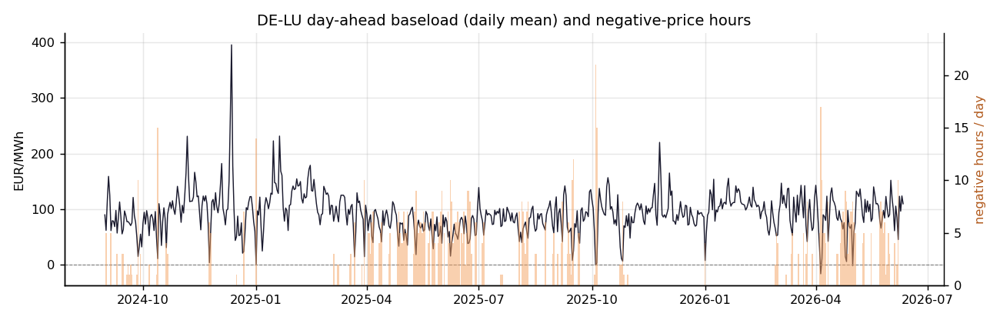
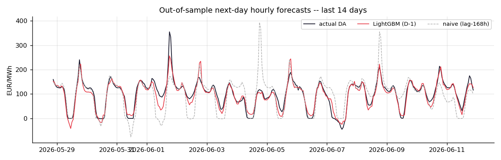
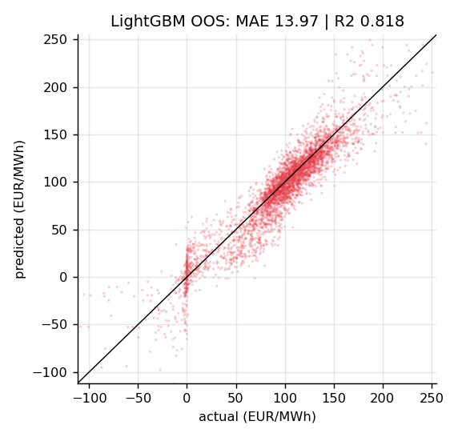
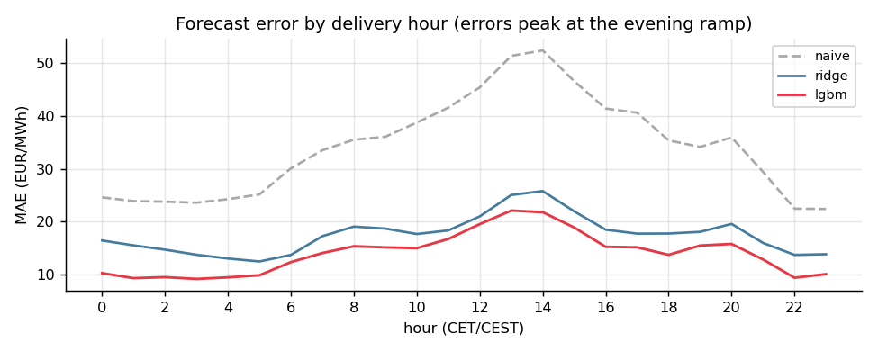
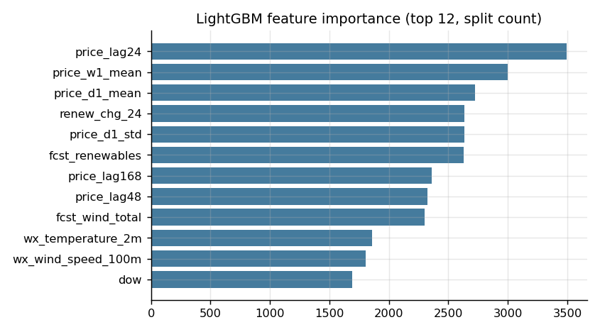
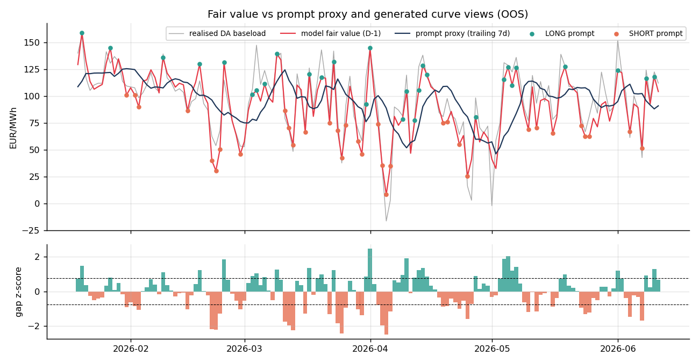

# European Power Fair Value — DE-LU Day-Ahead Forecasting & Prompt-Curve Views

**Author:** Philippe — **
**Market:** Germany–Luxembourg (DE-LU) · **Option A:** next-day hourly prices

A daily fair-value prototype: ingest public fundamentals, forecast tomorrow's 24 hourly EPEX day-ahead prices before the D-1 12:00 CET auction, translate the forecast into a front-week curve view, and auto-generate the morning desk note with one audited LLM call.



---

## 1. Data ingestion & QA

| Series | Source | Notes |
|---|---|---|
| DA auction prices, DE-LU (hourly, EUR/MWh) | [energy-charts.info](https://energy-charts.info) `/price` (Fraunhofer ISE, CC BY 4.0) | 15-min MTUs since 2025 resampled to hourly means |
| TSO day-ahead forecasts: solar, wind on/offshore (MW) | energy-charts `/public_power_forecast` | **ex-ante** values — available before the auction |
| Weather forecasts: temp 2 m, wind 100 m, SW radiation | [Open-Meteo Historical *Forecast* API](https://open-meteo.com) | forecasts **as originally issued**, not reanalysis |

Coverage: **2024-09-01 → 2026-06-11, 15 576 hourly rows**, UTC index. No API keys required; every raw response is cached under `data/raw/` (resumable, rate-limit friendly with pacing + exponential backoff).

**Leakage discipline.** Every exogenous feature is a *forecast* that existed before the D-1 auction, and price lags are restricted to ≥ 24 h (D-1 prices are published at D-2 12:45 CET). The backtest therefore replicates the live information set exactly.

**QA (`src/qa.py` → `reports/qa_report.json`): status PASS.** Eight checks: hourly-grid completeness, duplicate timestamps, per-column nulls, physical range bounds, negative-price share, robust-z spike detection, stale-feed runs, and DST integrity (every local day has 23/24/25 hours). Structural failures exit non-zero; market features only warn — e.g. **5.92 % of hours print negative**, which is a real property of DE-LU under renewables saturation and is deliberately kept in the dataset.

## 2. Forecasting & validation (Option A)

Three models, identical features, **walk-forward validation over the last 180 delivery days**: expanding training window, refit every 7 days, full delivery days predicted ahead — the exact cadence of a live D-1 process.

| Model | MAE (€/MWh) | RMSE | R² | Skill vs naive |
|---|---|---|---|---|
| Naive (same hour, lag-168 h) | 34.11 | 53.00 | 0.02 | — |
| Ridge (baseline) | 17.45 | 26.23 | 0.76 | +48.8 % |
| **LightGBM (improved)** | **13.97** | **22.81** | **0.82** | **+59.0 %** |





Errors concentrate in the **evening ramp (17–21 h)**, when solar rolls off into uncertain wind — exactly where marginal-unit switching makes prices most convex. Feature importance confirms the thesis that **well-engineered features beat model complexity at the DA stage**: recent price levels, the day-over-day renewables swing and the renewables forecasts dominate.



## 3. Prompt-curve translation

`src/trading.py` converts the hourly forecast into a daily **fair-value baseload** and compares it with a **prompt proxy** — the trailing 7-day realised DA baseload (front-week EEX settlements are not freely redistributable; prompt forwards settle close to expected DA outturn, and with a market-data licence the same code plugs real quotes straight in).

Signal: 60-day rolling **z-score of (fair value − prompt)**; |z| > 0.75 ⇒ LONG/SHORT front-week, else NEUTRAL. Views are scored against the **realised baseload of the delivered week (D…D+6)** — deliberately beyond the model's one-day horizon, so a correct call requires the DA-vs-curve divergence to persist.

| Out-of-sample (144 days) | |
|---|---|
| Active views | 63 (29 long / 34 short) |
| **Hit rate** | **76.2 %** |
| Avg captured spread | **+17.23 €/MWh** per active day |



**Use / invalidation** (full note in `reports/trading_note.md`): position sizes with |z| and is re-run every morning; flatten on (1) intraday TSO revision of D+1 wind+solar > 5 GW, (2) REMIT unplanned outage > 2 GW, (3) yesterday's model error > 2× its trailing 30-day std, (4) fuel/carbon shocks (TTF/EUA > 5 %) — the DA model carries no fuel features, so fuel-led curve moves are out of scope.

## 4. AI/LLM component

`src/ai_commentary.py` automates the last manual step of the daily process: **writing the morning note**. One structured call to the Anthropic Messages API (`claude-sonnet-4-6`) receives a JSON context computed entirely by the pipeline — fair value, gap z-score, drivers, OOS MAE, QA status — and verbalises it in two paragraphs.

- **The LLM never produces numbers** — it only narrates pipeline output, eliminating hallucination risk on quantitative content.
- **Full prompt + raw response logged** to `logs/llm_call_*.json` (auditable); see `logs/llm_call_example_response.json` and the resulting `reports/morning_note.md`.
- `--dry-run` builds and logs the exact prompt without credentials (used in CI).

## Repository structure & reproduction

```
powerfv/
├── run_all.py             # one-command pipeline
├── requirements.txt
├── submission.csv         # OOS predictions (id = UTC hour, y_pred)
├── CASE_STUDY.md          # 3-page write-up
├── src/                   # config, ingest, qa, features, models, trading,
│                          #   ai_commentary, make_figures
├── data/                  # dataset.csv, predictions_oos.csv, daily_views.csv, raw/ cache
├── reports/               # qa_report.json, model_metrics.json, trading_note.md, morning_note.md
├── figures/               # 6 PNGs used above
└── logs/                  # LLM prompts & responses
```

```bash
pip install -r requirements.txt
python run_all.py              # full pipeline, AI step in dry-run
ANTHROPIC_API_KEY=... python run_all.py --live-ai
```

First run pulls ~21 months of data (a few minutes due to polite API pacing); all responses are cached so reruns are instant. Tested on Python 3.12.

## Limitations & next steps

- The prompt proxy is a stand-in for EEX front-week settlements; with licensed quotes, the signal would be measured against actual tradable marks and transaction costs.
- No fuel/carbon/interconnector features: the model prices weather and renewables, not the fuel stack — by design at the DA horizon, but a CSS/CDS spread feature is the natural next step for the curve leg.
- Probabilistic extension: quantile LightGBM for P10/P90 bands would let the signal size on forecast dispersion, not just the point gap.
