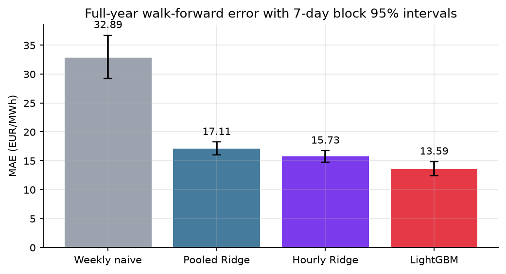
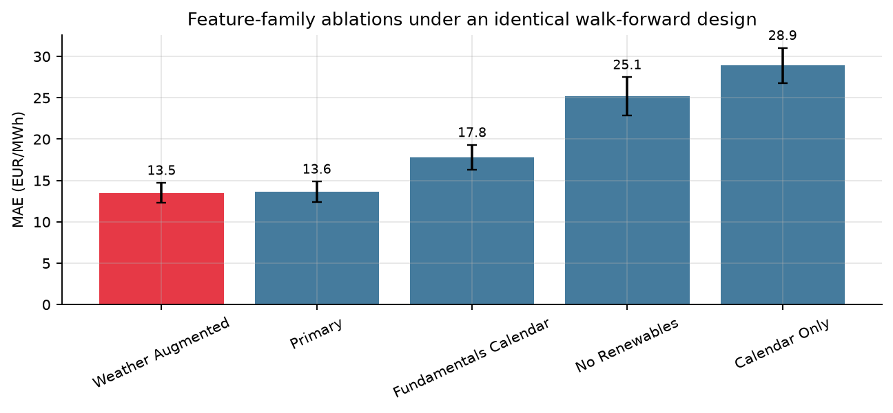
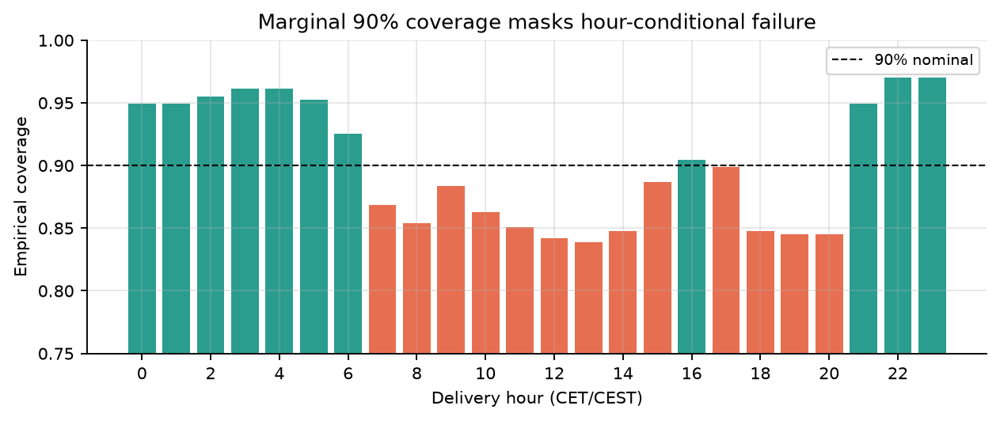
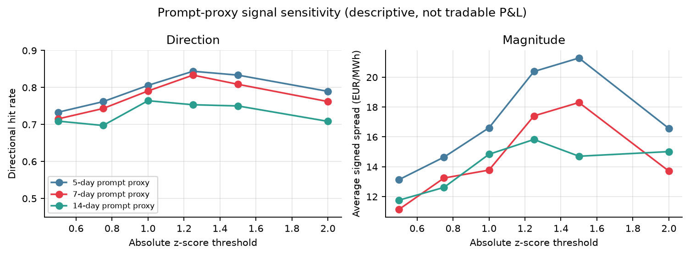

# European Power Fair Value

Companion repository for the paper **“Auditable Day-Ahead Electricity Price
Forecasting: Leakage Control, Conditional Failure Maps, and Walk-Forward
Evidence from Germany-Luxembourg.”**

Reproducible DE-LU day-ahead electricity-price forecasting, uncertainty
diagnostics, and prompt-proxy research.

**Author:** Bathaix Philippe-Emmanuel Yao  
**Release:** 1.1.0<br>
**Market:** Germany-Luxembourg day-ahead auction  
**Primary horizon:** all hourly prices for delivery day D, forecast before D-1
gate closure

[Read the paper](output/pdf/european-power-fair-value-paper.pdf) ·
[arXiv source package](output/pdf/european-power-fair-value-arxiv-source.tar.gz) ·
[citation metadata](CITATION.cff)

## Main result

The frozen experiment uses 15,576 hourly observations from 2024-08-31 through
2026-06-11. The last 365 local delivery days form a strict expanding-window
test; all fitted models are refitted every seven days.

| Model | MAE (EUR/MWh) | RMSE | Bias |
|---|---:|---:|---:|
| Weekly naive, lag 168 h | 32.89 | 51.21 | -0.87 |
| Pooled Ridge | 17.11 | 25.41 | -3.23 |
| Hour-specific Ridge, 24 models | 15.73 | 23.48 | -3.32 |
| **Deterministic LightGBM** | **13.59** | **22.22** | **-3.72** |

The LightGBM MAE has a seven-day moving-block bootstrap 95% interval of
12.39-14.86 EUR/MWh. Its daily MAE improvement is 2.13 EUR/MWh over the
strongest linear baseline and remains significant under a seven-lag HAC
variance estimate with the Harvey-Leybourne-Newbold finite-sample correction.
After excluding the first 90 test days, LightGBM MAE is 14.11 EUR/MWh over the
remaining 275 days.



## Information-set discipline

The primary model has 17 features:

- lagged prices and shifted rolling price statistics;
- TSO day-ahead solar and wind forecasts;
- the day-over-day renewable-forecast change;
- local hour, weekday, month, weekend, and holiday encodings.

The Open-Meteo Historical Forecast API stitches the first hours of successive
model runs; it does not preserve a fixed D-1 lead time for every target hour.
Weather variables are therefore excluded from the primary claim and retained
only in a clearly labelled sensitivity. That sensitivity changes MAE by less
than 1%.

Removing renewables raises primary-model MAE by about 85%, while using
renewables and calendar variables without price history gives 17.80 EUR/MWh.
The two feature families are complementary.



## Uncertainty and model risk

A rolling, strictly prequential residual interval achieves 90.07% empirical
coverage against a 90% nominal target on 8,040 forecasts. Aggregate
calibration is not uniform: 16 of 24 local hours reject nominal coverage after
Holm correction. The mean 90% interval score is 97.77. A 60-day prequential
bias correction reduces mean bias from -3.29 to +0.17 EUR/MWh on the common
window, but does not improve MAE (13.42 to 13.44).



The point model is also weakest in price tails:

- MAE is 21.59 EUR/MWh on negative-price hours;
- MAE is 61.12 EUR/MWh above 200 EUR/MWh;
- only 53.5% of realized above-200 hours are forecast above 200.

These diagnostics are part of the result, not hidden post-processing.

## Prompt-proxy diagnostic

The hourly forecast is averaged into next-day baseload fair value and compared
with a trailing day-ahead baseload proxy. The declared seven-day proxy and
absolute z-score threshold of 0.75 produce 144 evaluable active observations,
a 74.3% directional hit rate, and a mean signed forward-week spread of
13.25 EUR/MWh.

The same rule gives 54.5% for a weekly-naive forecast, 73.3% for the
hour-specific Ridge forecast, and 81.3% for an infeasible perfect day-D upper
bound. This bounds how much of the headline is model-specific.

This is **not a forward-market backtest**. The proxy is not a licensed EEX
front-week settlement, and the analysis excludes transaction costs, execution,
margin, and the forward risk premium. Right-censored end-of-sample outcomes
are excluded explicitly.



## Data and evidence

| Artifact | Purpose |
|---|---|
| `data/dataset.csv` | Frozen hourly target and source variables |
| `data/predictions_oos.csv` | 365-day hourly forecasts |
| `data/model_comparison.csv` | Metrics and block-bootstrap intervals |
| `data/dm_tests.csv` | HAC loss-differential tests |
| `data/ablation_metrics.csv` | Feature-family evidence |
| `data/regime_metrics.csv` | Seasonal, hourly, price, and renewable regimes |
| `data/conformal_diagnostics.csv` | Timestamp-level intervals and coverage |
| `data/conformal_hour_tests.csv` | Per-hour coverage tests and Holm adjustment |
| `data/bias_correction_diagnostics.csv` | Prequential bias-correction audit |
| `data/signal_sensitivity.csv` | Prompt-window and threshold grid |
| `data/signal_benchmarks.csv` | No-signal, model, and perfect-information bounds |
| `reports/research_metrics.json` | Paper results and SHA-256 fingerprints |

Prices and day-ahead renewable forecasts come from the Fraunhofer ISE
Energy-Charts API. Weather sensitivity data come from the Open-Meteo
Historical Forecast API. External API responses are cached on first ingestion;
the committed dataset is the authoritative paper input.

## Reproduce the paper

Python 3.12 is recommended.

```bash
python3 -m venv .venv
source .venv/bin/activate
python -m pip install -r requirements-paper.txt

python src/qa.py
python src/models.py
python src/trading.py
python src/research.py
python src/make_figures.py
python scripts/generate_paper_artifacts.py
python -m pytest -q

TECTONIC_BIN=tectonic bash scripts/build_paper.sh
bash scripts/package_arxiv.sh
```

On macOS, the standard LightGBM wheel requires OpenMP. Install `libomp`, or
build LightGBM from source with `USE_OPENMP=OFF`.

The ingestion stage is separate because public archives can revise historical
values:

```bash
python src/ingest.py
```

Running ingestion will legitimately change the dataset fingerprint.

## Repository layout

```text
.
├── data/                    frozen inputs and executable evidence
├── figures/                 README PNGs and vector PDFs
├── paper/                   LaTeX manuscript, tables, figures, metadata
├── reports/                 QA, model, research, and desk-note outputs
├── scripts/                 paper generation, reproduction, arXiv packaging
├── src/                     ingestion, features, models, research diagnostics
├── tests/                   leakage, reconciliation, and artifact tests
├── CITATION.cff
├── codemeta.json
└── requirements-paper.txt
```

## Commentary

`src/commentary.py` can turn pipeline-computed values into a short desk
note. It is isolated from the scientific calculations:

- the language model never computes paper numbers;
- prompts and responses are logged;
- dry-run mode performs no API call;
- no table, figure, metric, or test depends on generated text.

## Limitations

- One out-of-sample year is not a multi-cycle market benchmark.
- Upstream public archives may revise historical forecasts.
- Load, outages, fuel, carbon, and interconnector variables are absent.
- Integer calendar inputs are a compact baseline, not a full LEAR-style
  categorical specification.
- The symmetric interval has material hour-conditional miscalibration.
- The prompt proxy is not a tradable forward price.
- The artifact is research software, not a production execution system.

See the paper for the full methodology, equations, statistical assumptions,
and validation matrix.

## License

Code is released under the MIT License. Upstream datasets retain their own
terms and attribution requirements.
