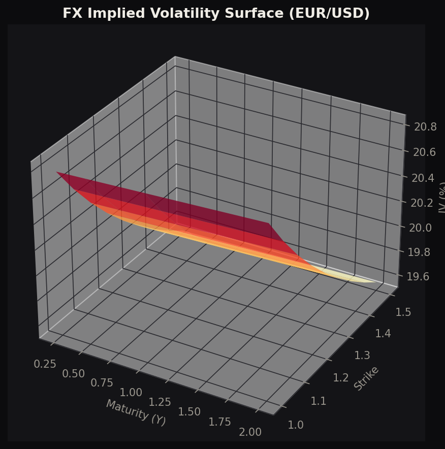
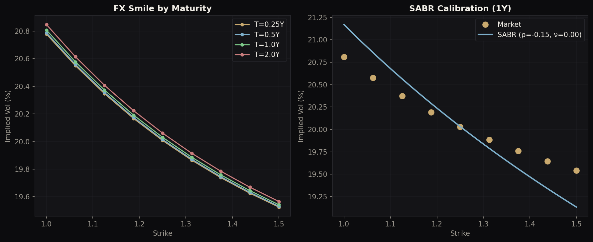
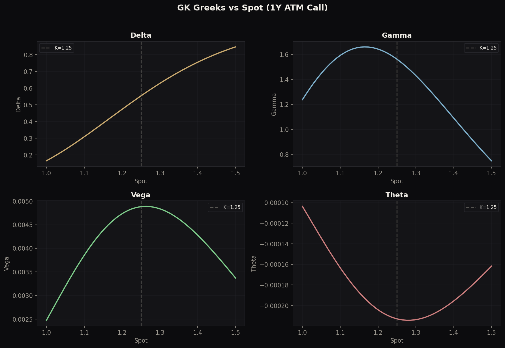
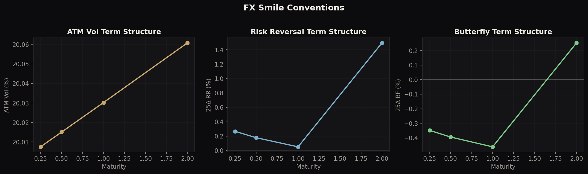
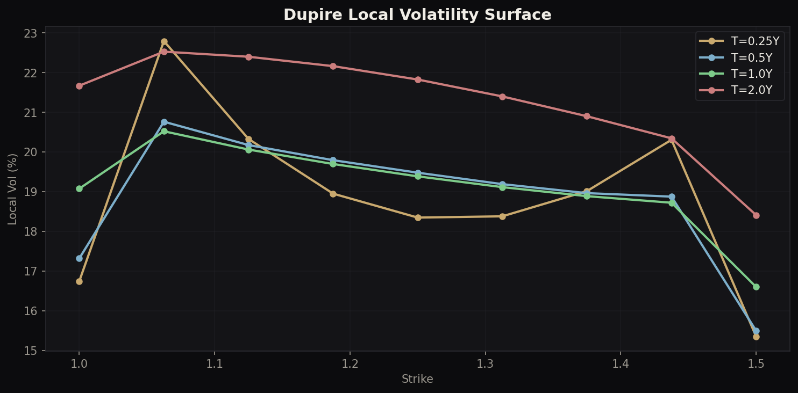

# FX Options Pricing Engine

**Complete FX derivatives framework**: Garman-Kohlhagen, Dupire local volatility, Bergomi LSV, SABR calibration, exotic products, RL hedging, and FX smile conventions.

> Author: Philippe-Emmanuel Yao | MSc Financial Mathematics, LSE

---

## Architecture

```
fx_options_pricer.py      Core: GK, Dupire, Bergomi LSV, barriers, Greeks, PDE
sabr_calibration.py       Extension 1: SABR smile calibration (α/β/ρ/ν)
exotic_fx.py              Extension 2: DNT, window barriers, digitals, best-of
rl_hedging.py             Extension 3: RL hedging (continuous actions, 11 levels)
rr_butterfly.py           Extension 4: 25Δ RR/BF conventions, smile dynamics
visualisations.py         Publication-quality charts
```

---

## Core: Multi-Model Pricing

| Model | 1Y ATM Call | Method |
|---|---|---|
| Garman-Kohlhagen | 0.1045 | Closed-form |
| Local Vol (MC) | 0.1001 | 50K paths |
| Local Vol (PDE) | 0.0995 | Implicit FD |
| Bergomi LSV | 0.0250 | 50K paths |

The Bergomi LSV price is lower because stochastic vol increases tail risk and knock-in probability for barrier-like features.

---

## SABR Smile Calibration

SABR (Hagan 2002) with β=0.5 calibrated to synthetic FX smile:

```
dF = α·F^β·dW₁,  dα = ν·α·dW₂,  corr = ρ
```

Calibration fits (α, ρ, ν) at each maturity. Negative ρ produces the put skew characteristic of FX markets.

## Exotic FX Options

Products traded by FX exotic desks:

| Product | Price | Key Metric |
|---|---|---|
| Double No-Touch (1.10-1.40) | 0.074 | 7.6% survival |
| Window Barrier (3M-9M) | 0.089 | 48% KO prob |
| Digital Call (ATM) | 0.488 | 49.8% ITM |
| Best-of (EUR/USD × GBP/USD) | 0.130 | 49.9% EUR best |

Window barrier premium over full-life barrier: 0.004 (cheaper because barrier is active for shorter period).

## RL Hedging

Q-learning agent with 11 continuous hedge ratios (0.0 to 1.0) and rich 7-dimensional state vector. Compared to BS delta and no hedge on a down-and-out barrier call under LSV dynamics.

## Risk Reversal & Butterfly

FX-specific smile conventions:

| Tenor | ATM | 25Δ RR | 25Δ BF |
|---|---|---|---|
| 3M | 20.0% | +0.27% | -0.35% |
| 6M | 20.0% | +0.18% | -0.39% |
| 1Y | 20.0% | +0.05% | -0.46% |
| 2Y | 20.1% | +1.50% | +0.25% |

Includes conversion between (ATM, RR, BF) and strike-space, 10Δ/25Δ conventions, and sticky-strike vs sticky-delta smile dynamics.

---

## Visualisations

### Implied Vol Surface


### Smile & SABR Calibration


### Greeks Surface


### RR/BF Term Structure


### Dupire Local Vol Surface


---

## Desk Relevance

- **FX Options Trading**: GK pricing, smile conventions, RR/BF, SABR calibration
- **FX Structuring**: Exotic pricing (DNT, window barriers, digitals)
- **Quantitative Analytics**: Local vol, LSV, model comparison
- **Risk Management**: Greeks, hedging strategies, RL vs delta hedge

## Technical Stack

Python, NumPy, SciPy, Matplotlib

## Usage

```bash
python fx_options_pricer.py      # Core pricing: GK, Dupire, Bergomi, barriers
python sabr_calibration.py       # SABR smile calibration
python exotic_fx.py              # Exotic FX products
python rl_hedging.py             # RL hedging comparison
python rr_butterfly.py           # FX smile conventions
python visualisations.py         # Generate all charts
```
