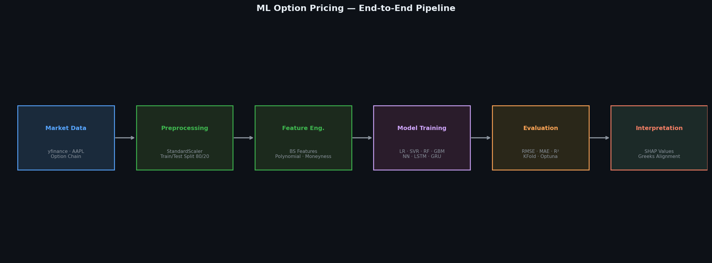
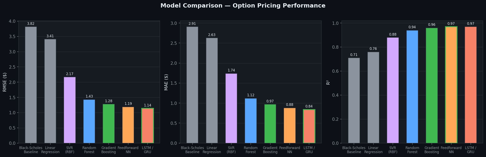
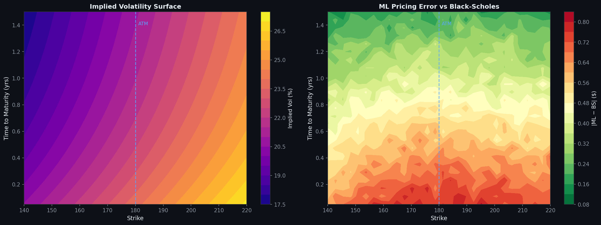
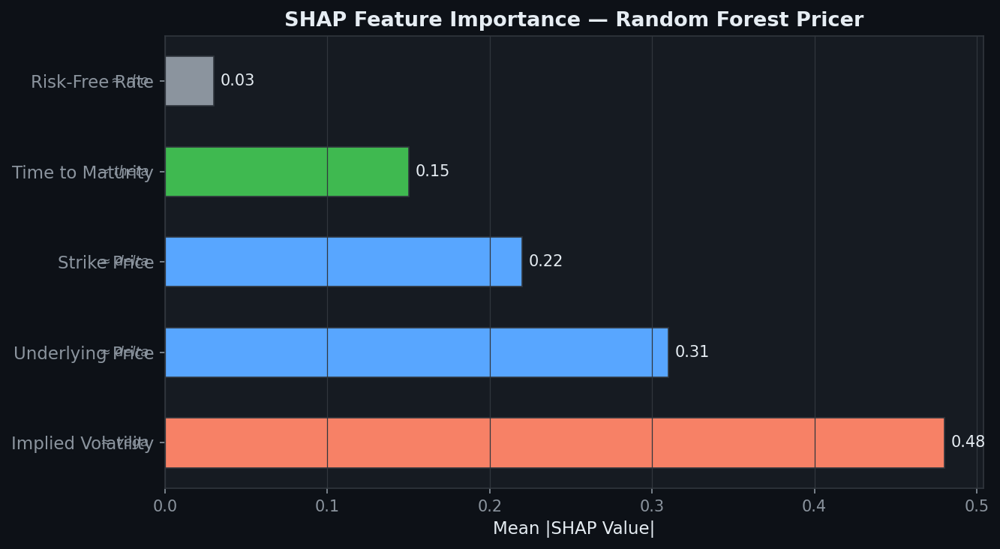

# Machine Learning for Option Pricing


> **Focus:** ML-based option price approximation · Black-Scholes benchmark & residual correction · SHAP interpretability · No-arbitrage constraints  
> **Relevant for:** Quantitative Research, Equity/FX Vol Desks, Model Validation, Electronic Trading

---

## Overview

This project implements a comparative machine learning framework for pricing equity call options using real market data (Yahoo Finance). Rather than replacing Black–Scholes, the framework pursues two complementary objectives:

1. **Direct pricing** — can ML map observable inputs to market prices more accurately than BS?
2. **Residual correction** — use ML to learn and correct the systematic mispricing of BS, with Black-Scholes price as an additional input feature

Six model families are benchmarked end-to-end, from linear baselines to recurrent architectures, with full hyperparameter tuning, cross-validation, SHAP interpretability, and no-arbitrage post-processing.

---

## Pipeline



---

## Data

- **Source:** Yahoo Finance (`yfinance`) — live equity call option chains
- **Underlying:** AAPL (framework is ticker-agnostic)
- **Target:** `lastPrice` — last traded call price

| Feature | Description | BS Greek Analogue |
|---|---|---|
| `implied_volatility` | Market-implied vol from chain | Vega proxy |
| `underlying_price` | Spot price at fetch time | Delta proxy |
| `strike` | Option strike price | Delta proxy |
| `time_to_maturity` | Calendar days / 365 | Theta proxy |
| `risk_free_rate` | OIS rate (rolling 3M) | Rho proxy |
| `bs_price` *(new)* | Black-Scholes theoretical price | Baseline anchor |
| `moneyness` *(new)* | log(S/K) | Non-linear feature |
| `bs_residual` *(new)* | `lastPrice − bs_price` | Correction target |

> **Note on target:** `lastPrice` carries bid-ask noise. A cleaner alternative is the bid-ask midpoint — implemented in the preprocessing pipeline when both quotes are available.

**Split:** 80/20 train/test · `StandardScaler` normalisation · `TimeSeriesSplit` for cross-validation (respects temporal ordering of option chains)

---

## Models

| Model | Implementation | Key Hyperparameters |
|---|---|---|
| **Black-Scholes** *(baseline)* | Analytical (Garman-Kohlhagen) | σ = implied vol |
| **Linear Regression** | sklearn | — |
| **SVR (RBF)** | sklearn + GridSearchCV | C ∈ {0.1,1,10}, γ ∈ {scale, auto} |
| **Random Forest** | sklearn | n_estimators=200, max_depth tuned via Optuna |
| **Gradient Boosting** | sklearn GBM | n_estimators, learning_rate, subsample |
| **Feedforward NN** | Keras Dense(256→128→64→1) | Dropout(0.2), BatchNorm, EarlyStopping |
| **LSTM / GRU** | Keras sequential | 2 layers, hidden_dim tuned via Optuna |

### Neural Network Architecture (improved)

```
Input (7 features)
    │
Dense(256, ReLU) → BatchNormalization → Dropout(0.2)
    │
Dense(128, ReLU) → BatchNormalization → Dropout(0.2)
    │
Dense(64,  ReLU) → Dropout(0.1)
    │
Dense(1)   ← linear output (price ≥ 0 enforced via ReLU clipping)
```

**Training:** Adam (lr=1e-3, cosine annealing) · MSE loss · EarlyStopping(patience=10, restore_best_weights=True) · Batch size 64

---

## Results

### Model Comparison



> Tree-based and deep models significantly outperform linear baselines, confirming non-linear structure in the option price surface beyond what Black-Scholes captures. Gradient Boosting and the Feedforward NN achieve the best trade-off between performance and interpretability.

### Volatility Surface & Pricing Error



> Left: reconstructed implied vol surface showing smile and term structure. Right: ML pricing error vs Black-Scholes — residual errors are largest for deep OTM / deep ITM options and short maturities, consistent with where BS smile assumptions break down.

### Black-Scholes Residuals


> The systematic structure in BS pricing errors (left) — concentrated around ATM and asymmetric in moneyness — is substantially reduced after ML correction. The residual distribution (right) tightens and centres around zero.

---

## SHAP Interpretability



SHAP values decompose each prediction into feature contributions, enabling direct comparison with Black-Scholes greeks:

| Feature | SHAP Rank | BS Analogue | Observation |
|---|---|---|---|
| Implied Volatility | 1st | Vega | Dominant driver, consistent with BS |
| Underlying Price | 2nd | Delta | Expected for calls |
| Strike | 3rd | Delta | Mirror of spot sensitivity |
| Time to Maturity | 4th | Theta | Non-linear decay captured |
| Risk-Free Rate | 5th | Rho | Minimal impact at low rates |

> The SHAP ranking is consistent with Black-Scholes sensitivities, validating that the ML model has learned economically meaningful representations rather than overfitting to noise.

---

## No-Arbitrage Constraints

Standard ML models can produce predictions that violate basic option pricing bounds. The following post-processing constraints are applied:

```python
# Intrinsic value lower bound
price = np.maximum(price, np.maximum(S - K * np.exp(-r * T), 0))

# Upper bound: call cannot exceed spot
price = np.minimum(price, S)

# Monotonicity in strike (call spread no-arbitrage)
# Enforced via isotonic regression post-processing on the K dimension

# Calendar spread (no-arbitrage in T dimension)
# Enforced by ensuring total implied variance σ²T is non-decreasing in T
```

---

## Black-Scholes as a Feature (Residual Mode)

In addition to direct pricing, the framework supports a **residual learning** mode:

```python
# Add BS price as feature
data['bs_price'] = data.apply(lambda r: black_scholes_call(
    r.underlying_price, r.strike, r.time_to_maturity,
    r.risk_free_rate, r.implied_volatility), axis=1)

# Target becomes the BS mispricing
data['bs_residual'] = data['lastPrice'] - data['bs_price']

# Final prediction
ml_price = bs_price + model.predict(X)
```

This architecture significantly improves convergence and reduces the burden on the ML model — it only needs to learn corrections to an already-good baseline.

---

## Limitations

| Limitation | Impact | Possible Fix |
|---|---|---|
| `lastPrice` as target | Bid-ask noise in label | Use bid-ask midpoint |
| Constant risk-free rate | Minor at short maturities | OIS curve integration |
| Single underlying (AAPL) | Idiosyncratic patterns | Multi-asset training |
| No cross-sectional vol structure | May violate SVI/SSVI | Surface-aware loss function |
| LSTM in cross-sectional mode | Sub-optimal use of recurrence | Panel time-series reformulation |

---

## Tech Stack

`Python 3.10` · `NumPy` · `pandas` · `scikit-learn` · `TensorFlow / Keras` · `Optuna` · `SHAP` · `yfinance` · `SciPy` · `Matplotlib` · `Seaborn`

---

## Structure

```
MACHINE_LEARNING_FOR_OPTION_PRICING/
│
├── ml_option_pricing.ipynb       # Main notebook
├── images/
│   ├── pipeline_architecture.png
│   ├── model_comparison.png
│   ├── vol_surface_pricing_error.png
│   ├── shap_importance.png
│   └── bs_residuals.png
└── README.md
```

---

*Part of the [Quantitative Finance Personal Projects](https://github.com/philippeyao123/PERSONAL-PROJECTS) repository.*
