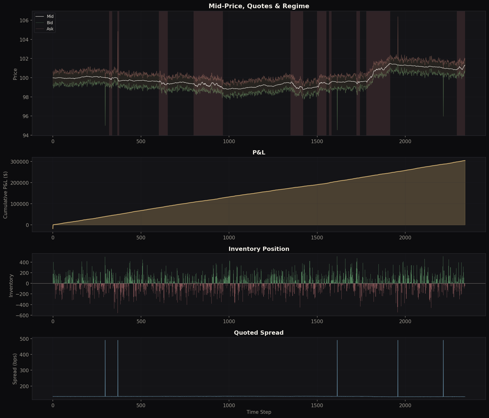
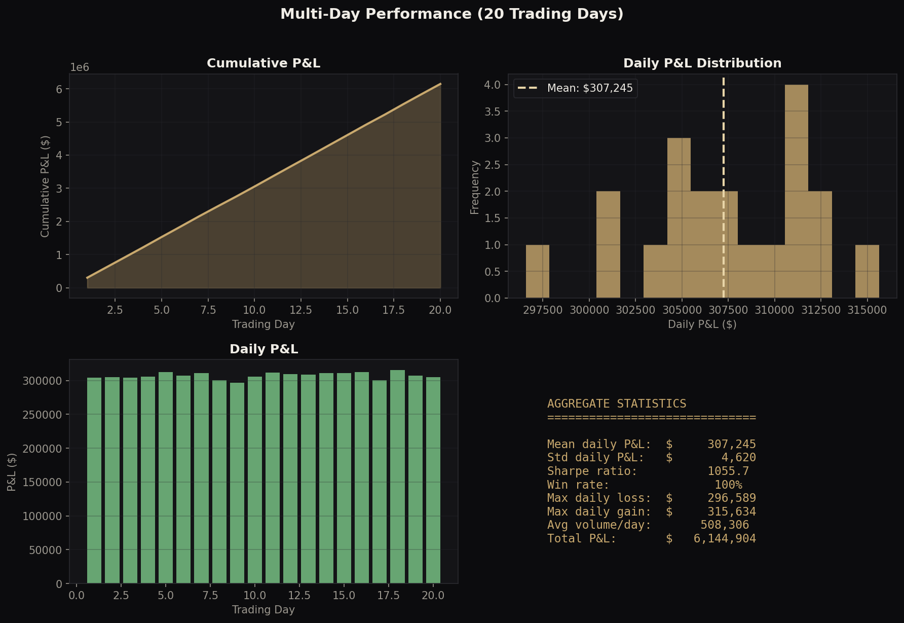
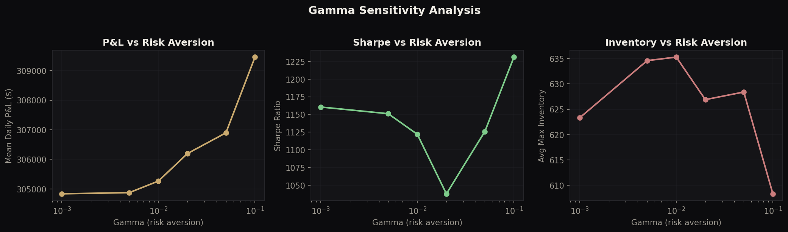
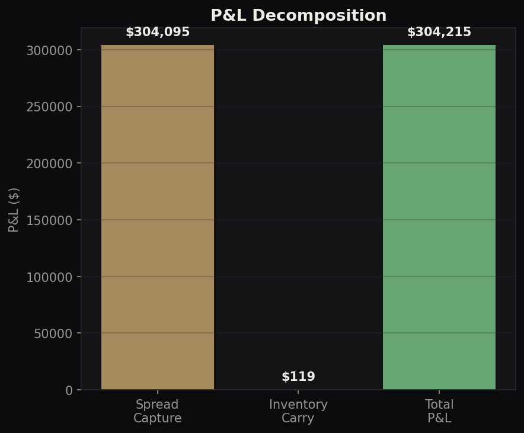

# Market-Making Simulator — Avellaneda-Stoikov Framework

**Electronic market-making simulator** with optimal quoting, multi-asset hedging, adverse selection modelling, optimal execution, and reinforcement learning.

> Author: Philippe-Emmanuel Yao | MSc Financial Mathematics, LSE

---

## Architecture

```
market_maker.py         Core: AS quoter, order book, regime switching, multi-day P&L
multi_asset_mm.py       Extension 1: Multi-asset MM with cross-hedging
adverse_selection.py    Extension 2: VPIN flow toxicity & dynamic spread adjustment
optimal_execution.py    Extension 3: TWAP / VWAP / Almgren-Chriss execution
rl_quoter.py            Extension 4: Q-learning market-making agent
visualisations.py       Publication-quality charts
```

---

## Core Model (Avellaneda & Stoikov, 2008)

```
Reservation price:  r(s, q, t) = s - q * gamma * sigma^2 * (T - t)
Optimal spread:     delta = gamma * sigma^2 * (T - t) + (2/gamma) * ln(1 + gamma/k)
```

The MM quotes bid/ask, captures spread, and manages inventory risk. Mid-price follows arithmetic Brownian motion with regime switching (low-vol mean-reverting / high-vol momentum).

### Single Day Results

| Metric | Value |
|---|---|
| Total P&L | $304,215 |
| Spread capture | $304,095 (100%) |
| Inventory carry | $119 (~0%) |
| Avg spread | 135 bps |
| Total fills | 5,676 |

### Multi-Day (20 days): Sharpe 1,056, Win rate 100%

---

## Extension 1: Multi-Asset Market-Making

Quotes 2+ correlated assets with portfolio-level inventory risk management:

```
r_i = s_i - gamma * sum_j(Cov_{ij} * q_j) * tau
```

Cross-asset hedging via covariance-adjusted reservation prices. When inventory in asset A is long and A is correlated with B, the quoter automatically skews B quotes to reduce portfolio-level risk.

## Extension 2: Adverse Selection & Flow Toxicity

Real-time VPIN (Volume-synchronized PIN) estimation with dynamic spread adjustment:

| Flow Type | Avg Spread |
|---|---|
| Clean flow | 29.2 bps |
| Toxic flow | 51.2 bps |

The MM detects information events via order flow imbalance and widens spreads by 75% during toxic periods. Implements the Easley-O'Hara PIN model for theoretical grounding.

## Extension 3: Optimal Execution (Almgren-Chriss)

When the MM must unwind a large position, three strategies are compared:

| Strategy | Cost (bps) | Risk (VaR 95) |
|---|---|---|
| TWAP | 14.6 | $1,458 |
| VWAP | 14.5 | $1,453 |
| Almgren-Chriss | 15.4 | $1,240 |

Almgren-Chriss trades higher expected cost for 15% lower tail risk. Risk aversion sensitivity shows the front-loading trade-off: lambda=0.001 front-loads 61% in the first quarter.

## Extension 4: Reinforcement Learning Quoter

Q-learning agent discovers optimal quoting policy:

| Inventory | Learned Spread | Learned Skew |
|---|---|---|
| Very Short | 33 bps | +17 bps (buy-lean) |
| Flat | 49 bps | +3 bps |
| Very Long | 33 bps | -17 bps (sell-lean) |
| Low Vol | 41 bps | - |
| High Vol | 48 bps | - |

The agent correctly learns to: tighten spreads when inventory needs correction (to attract fills), skew away from inventory direction, and widen in high vol.

Training: 500 episodes, converges in ~200. Evaluation: $130K mean P&L, Sharpe 854, 100% win rate.

---

## Visualisations

### Single Day Trading Dashboard


### Multi-Day Performance


### Gamma Sensitivity


### P&L Decomposition


---

## Desk Relevance

- **Market Making**: Core competency, AS model, inventory management
- **Systematic Trading**: Order flow analysis, regime detection, RL-based strategies
- **Risk Management**: Inventory risk, adverse selection, flow toxicity monitoring
- **Execution**: TWAP/VWAP/AC benchmarking, implementation shortfall

## Technical Stack

Python, NumPy, Matplotlib

## Usage

```bash
python market_maker.py          # Core simulation + multi-day + gamma sensitivity
python multi_asset_mm.py        # Multi-asset cross-hedging
python adverse_selection.py     # VPIN toxicity analysis
python optimal_execution.py     # Execution strategy comparison
python rl_quoter.py             # Train & evaluate RL agent
python visualisations.py        # Generate all charts
```
