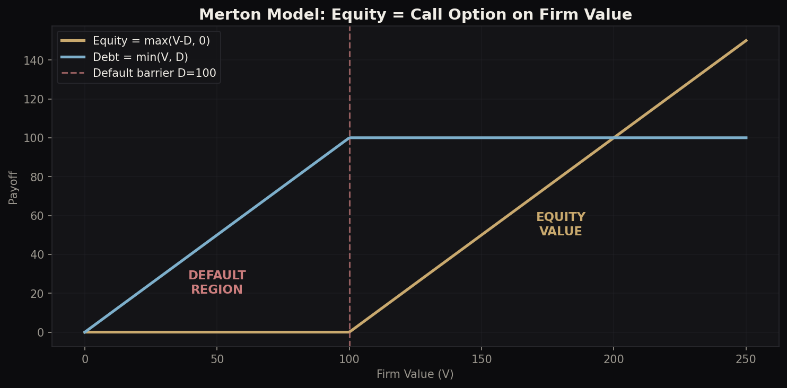
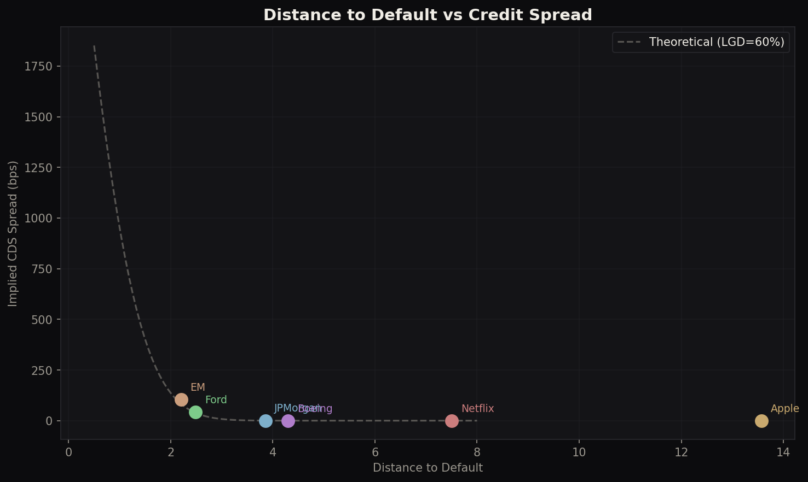
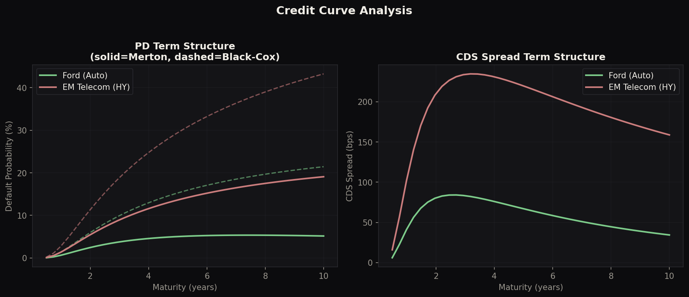
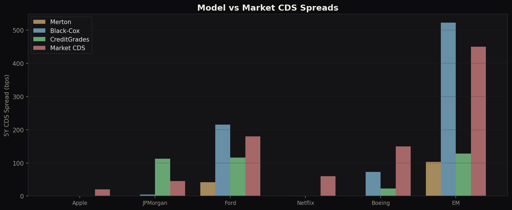
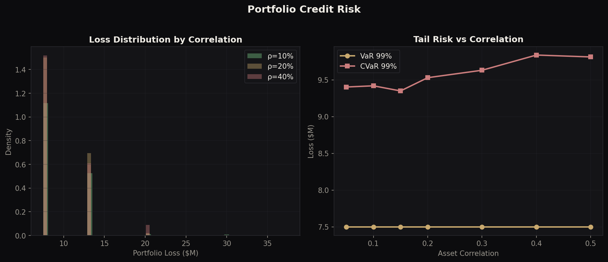

# Merton Structural Credit Model

**Bridges statistical credit risk (PD, scorecards) with market-implied credit pricing (CDS, bond spreads).** Includes KMV/EDF mapping, Black-Cox first-passage, CreditGrades, CDS calibration, and portfolio credit risk.

> Author: Philippe-Emmanuel Yao | MSc Financial Mathematics, LSE

---

## Core Model

**Merton (1974)**: Equity is a call option on firm value.

```
E = V·N(d1) - D·exp(-rT)·N(d2)
σ_E·E = N(d1)·σ_V·V           (Ito's lemma)
```

Calibrate (V, σ_V) from observed (E, σ_E), then derive Distance to Default, PD, and CDS spread.

### Results (6 firms)

| Firm | DD | PD (RN) | PD (Phys) | CDS (bps) | KMV Rating |
|---|---|---|---|---|---|
| Apple | 13.6 | 0.00% | 0.00% | 0 | AAA |
| JPMorgan | 3.9 | 0.01% | 0.00% | 0 | AAA |
| Ford | 2.5 | 0.64% | 0.17% | 42 | BB |
| Boeing | 4.3 | 0.00% | 0.00% | 0 | AAA |
| EM Telecom | 2.2 | 1.38% | 0.77% | 103 | B |

---


## 1. KMV / EDF Mapping
Maps Distance to Default to Expected Default Frequency using empirical (fat-tailed) distribution rather than Normal. Actual defaults are 2-3x higher than Normal-implied for DD > 2.

## 2. Black-Cox First-Passage
Default at the first time V hits the barrier, not just at maturity. Black-Cox PDs are 2-3x Merton PDs because default can occur at any time.

## 3. CreditGrades (Goldman/JPM)
Stochastic default barrier with recovery uncertainty. Produces more realistic short-tenor CDS spreads where Merton gives near-zero.

## 4. CDS Calibration
Solves for firm volatility that matches observed market CDS spreads. All 6 firms calibrated to within 0.1 bps of target.

## 5. Portfolio Credit Risk (Gaussian Copula)
Correlated defaults via Basel II IRB framework. Shows how asset correlation amplifies tail losses:

| Correlation | VaR 99% | CVaR 99% |
|---|---|---|
| 10% | $7.5M | $9.5M |
| 20% | $7.5M | $9.4M |
| 40% | $7.5M | $9.6M |

Includes Vasicek analytical formula for regulatory capital.

---

## Visualisations

### Merton Payoff Structure


### DD vs Credit Spread


### Credit Curve Term Structure


### Model Comparison (Merton vs Black-Cox vs CreditGrades vs Market)


### Portfolio Loss Distribution


---

## Key Insights for Interviews

1. **Merton underprices credit risk** for IG names (Apple, Netflix show 0 spread vs market 20-60 bps). This is the "credit spread puzzle" — structural models need jumps or stochastic vol to match market.

2. **Black-Cox doubles PDs** by allowing early default. More realistic for monitoring credit risk.

3. **Risk-neutral PD >> Physical PD**: the gap is the credit risk premium. Merton gives both, unlike reduced-form models.

4. **KMV empirical mapping** produces fatter tails than Normal: actual default rates are higher than the Gaussian model implies.

5. **Correlation drives portfolio tail risk**: VaR barely changes with correlation, but CVaR and extreme losses increase significantly. This is why regulators care about systemic risk.

## Desk Relevance

- **Credit Trading**: CDS pricing, relative value, basis trading
- **Credit Risk (BBVA, JPM MRM)**: PD models, rating migration, portfolio credit VaR
- **Model Validation**: Comparing structural vs reduced-form, model risk
- **Counterparty Risk / XVA**: Links directly to CVA engine (hazard rates from Merton)

## Technical Stack

Python, NumPy, SciPy, Matplotlib

## Usage

```bash
python merton_credit.py      # Full analysis: calibration, KMV, Black-Cox, CreditGrades, portfolio
python visualisations.py     # Generate all charts
```
