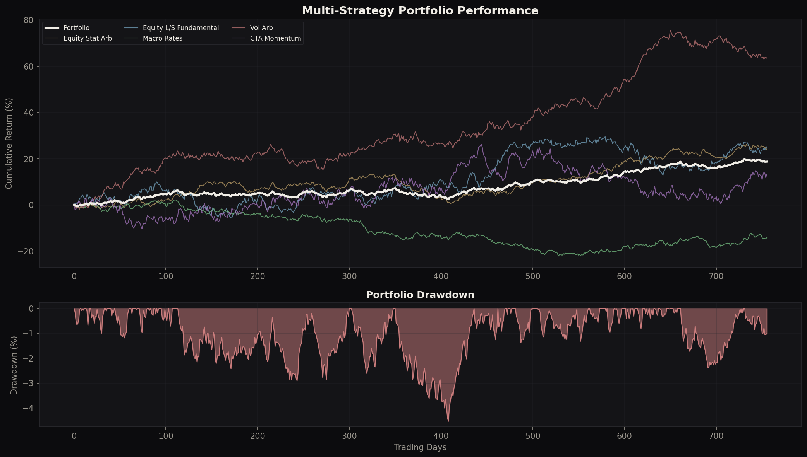
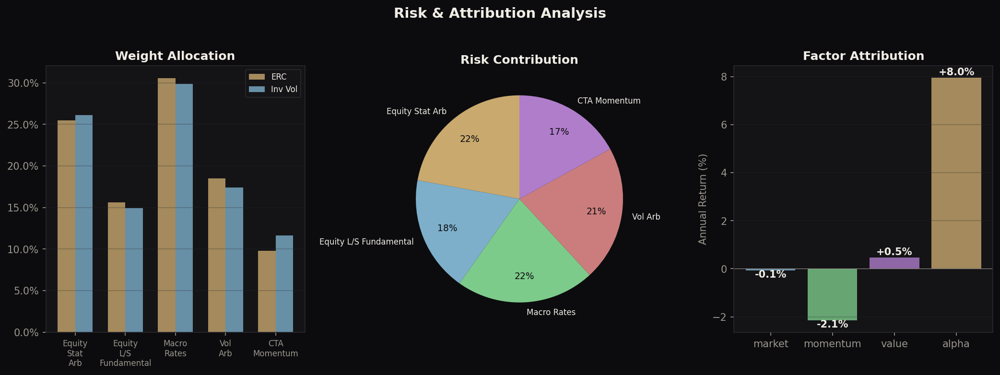
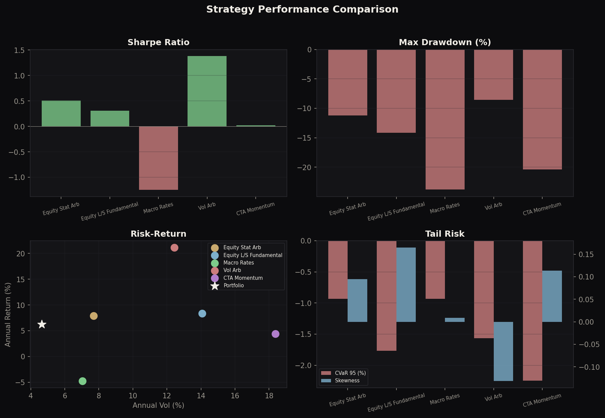
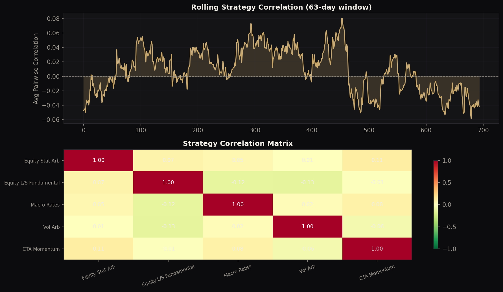
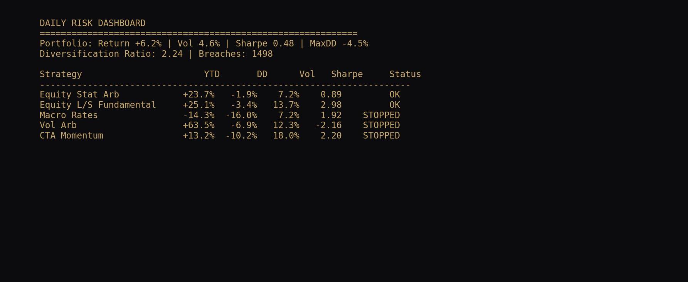

# Multi-Strategy Portfolio Backtester

**Pod shop risk management framework** with stress testing, dynamic allocation, transaction costs, and liquidity risk.

> Author: Philippe-Emmanuel Yao | MSc Financial Mathematics, LSE

---

## Architecture

```
portfolio_backtester.py    Core: factor model, ERC, attribution, drawdown, pod monitoring
stress_testing.py          Extension 1: Crisis replay (GFC, COVID, 2022, Quant Quake)
dynamic_allocation.py      Extension 2: Regime-aware rebalancing
transaction_costs.py       Extension 3: Costs, slippage, breakeven analysis
liquidity_risk.py          Extension 4: Liquidation cost, crowding, LVaR
visualisations.py          Publication-quality charts
```

---

## Base Case: 5-Pod Portfolio, 3Y Backtest, $100M

| Metric | Value |
|---|---|
| Annual Return | 6.2% |
| Annual Vol | 4.7% |
| Sharpe | 0.48 |
| Sortino | 0.79 |
| Max Drawdown | -4.5% |
| Diversification Ratio | 2.24x |

Alpha (+8.0% pa) dominates factor contributions. Portfolio is near market-neutral.

---

## Stress Testing & Crisis Scenarios

Replay of 6 historical crises with pod-level P&L impact:

| Scenario | Portfolio Loss | Worst Pod | Pod Loss |
|---|---|---|---|
| GFC 2008 | -38.6% | CTA Momentum | -70.8% |
| COVID Mar 2020 | -7.3% | CTA Momentum | -15.7% |
| 2022 Rates Shock | -42.7% | CTA Momentum | -92.8% |
| EM Crisis | -0.5% | Equity L/S | -5.7% |
| Volmageddon 2018 | -2.0% | CTA Momentum | -14.4% |
| Quant Quake 2007 | +1.5% | Equity Stat Arb | -5.6% |

Includes reverse stress testing: finds the mildest market conditions that breach a given loss threshold.

## Dynamic Regime-Aware Allocation

Detects vol/correlation regimes (risk-on, risk-off, crisis) and adjusts weights:

- **Risk-on**: Full allocation, ERC weights
- **Risk-off**: Reduce high-vol pods, lower portfolio vol target
- **Crisis**: Minimum allocation, favour low-beta strategies

## Transaction Costs & Slippage

Models 5 cost components: commission, spread, market impact, slippage, financing.

| Strategy | Gross Sharpe | Net Sharpe | Annual Cost |
|---|---|---|---|
| Equity Stat Arb | 1.03 | -0.60 | 12.5% |
| Vol Arb | 1.70 | 0.77 | 11.6% |
| Portfolio | 1.22 | -0.72 | 10.8% |

**Sharpe decay of 1.93**: gross Sharpe 1.22 becomes net -0.72 after costs. This is realistic for leveraged strategies and shows why cost management is critical.

Includes breakeven analysis: Stat Arb has only 1.7bps margin above breakeven, making it fragile to cost increases.

## Liquidity Risk

Three liquidation scenarios (normal, stress, fire sale) plus crowding and LVaR:

| Scenario | Avg Cost | Portfolio LVaR |
|---|---|---|
| Normal | 5 bps | - |
| Stress | 17 bps | 1.21x VaR |
| Fire sale | 16 bps | - |

LVaR adds a 21% liquidity premium to standard VaR. This is the gap that standard risk models miss.

---

## Visualisations

### Cumulative Returns & Drawdown


### Risk & Attribution Analysis


### Strategy Metrics


### Correlation Regime


### Risk Dashboard


---

## Pod Shop Relevance

- **Millennium / Citadel / Balyasny**: Pod allocation, stop-loss monitoring, factor exposure
- **Risk Management**: Stress testing, LVaR, correlation regime, crowding
- **Portfolio Construction**: ERC, dynamic allocation, cost-aware sizing
- **Compliance**: Reverse stress testing, breach logging, limit monitoring

## Technical Stack

Python, NumPy, SciPy, Matplotlib

## Usage

```bash
python portfolio_backtester.py     # Core backtest + analytics
python stress_testing.py           # Crisis scenario replay
python dynamic_allocation.py       # Regime-aware allocation
python transaction_costs.py        # Cost analysis + breakeven
python liquidity_risk.py           # Liquidation + LVaR
python visualisations.py           # Generate all charts
```
