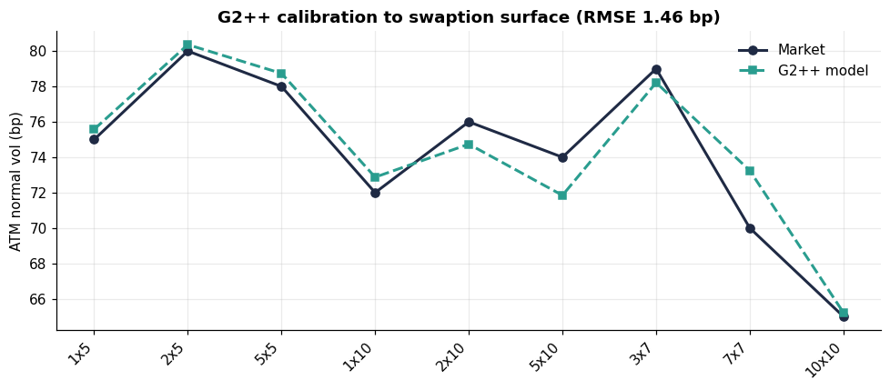
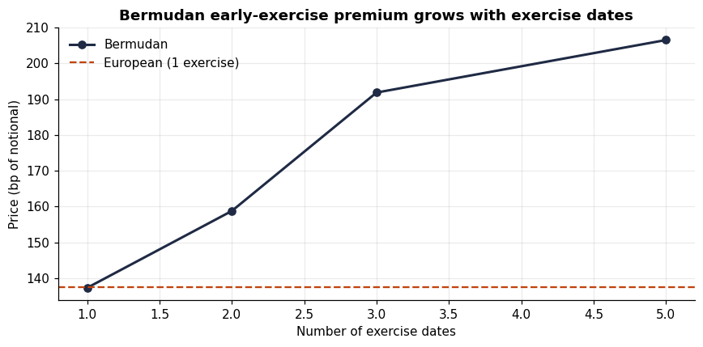
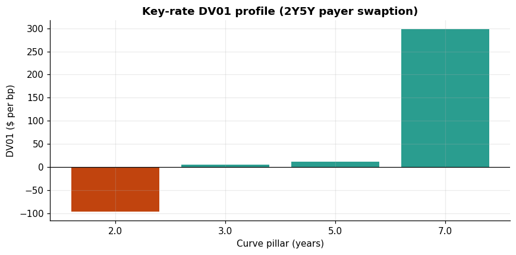

# G2++ Swaption Engine


A rates-desk swaption toolkit: calibrate a **two-factor Gaussian (G2++)** model
to a swaption volatility surface, price **European** swaptions semi-analytically
and **Bermudan** swaptions by **Longstaff-Schwartz**, and run a full
**bump-and-revalue risk engine** (bucketed DV01, vega, scenarios).

The whole pipeline — *calibration → pricing → risk* — is the daily workflow of
a rates Strat. The design priority is **provable correctness**: the
semi-analytic G2++ European price is validated against an independent Monte
Carlo to <1%, and the Bermudan LSM is checked to (a) equal the European when
given a single exercise date and (b) exceed it once early exercise is allowed.

---

## Why G2++ and normal vol

- **Two factors**, not one: a single-factor Hull-White cannot reproduce
  realistic curve-shape (steepener/flattener) risk that Bermudan swaptions are
  exposed to. G2++ adds a second mean-reverting factor with correlation `rho`,
  capturing decorrelation of curve points while staying analytically tractable
  for Europeans.
- **Normal (Bachelier) vol** is the primary quoting convention: post-2008,
  EUR/GBP rates can be negative, so lognormal Black breaks down. The analytic
  layer provides both, defaulting to Bachelier.

---

## Pipeline

| Stage | Module | What it does |
|-------|--------|--------------|
| Curve | `curve/yield_curve.py` | Log-linear DF interpolation, bumps for risk |
| Instruments | `instruments/swap.py` | Swap annuity, forward swap rate; swaption |
| Analytic | `pricing/analytic.py` | Black-76 & Bachelier; normal-vol inversion |
| Smile | `models/sabr.py` | SABR (Hagan normal-vol approximation) |
| Model | `models/g2pp.py` | G2++ bonds + **semi-analytic European** (1-D integral) |
| Monte Carlo | `pricing/montecarlo.py` | Curve-consistent G2++ path simulator |
| Bermudan | `pricing/bermudan.py` | **Longstaff-Schwartz** with train/test policy split |
| Calibration | `calibration/calibrate.py` | Least-squares fit of G2++ to a vol surface |
| Risk | `risk/engine.py` | Bucketed DV01, vega, parallel/tilt/vol scenarios |

---

## Quickstart

```bash
pip install -e ".[dev,viz]"
python -m swaptions_engine.make_figures   # regenerate figures below
pytest                                    # 14 tests (incl. analytic-vs-MC)
```

```python
from swaptions_engine.curve.yield_curve import Curve
from swaptions_engine.calibration.calibrate import G2ppCalibrator, SurfacePoint
from swaptions_engine.models.g2pp import G2pp
from swaptions_engine.instruments.swap import VanillaSwap, Swaption
from swaptions_engine.pricing.bermudan import BermudanLSM

curve = Curve.flat(0.025)
surface = [SurfacePoint(1, 5, 0.0075), SurfacePoint(2, 5, 0.0080), ...]
res = G2ppCalibrator(curve).calibrate(surface)        # fit G2++

model = G2pp(curve, res.params)
swap = VanillaSwap(start=1.0, tenor=5.0, fixed_rate=0.03)
euro = model.european_swaption(swap, payer=True)       # semi-analytic
berm = BermudanLSM(model).price(
    Swaption(swap, [1, 2, 3, 4, 5], "bermudan"), n_paths=50_000
)                                                      # LSM
```

---

## Results

### Calibration to a swaption surface

Least-squares fit of the five G2++ parameters to an ATM normal-vol surface.
The model reprices the surface to **sub-2bp RMSE** across expiries and tenors.



### Bermudan early-exercise premium

The LSM Bermudan price starts exactly at the European (a single exercise date)
and rises monotonically as more exercise dates are added — the early-exercise
optionality, priced correctly.



### Key-rate DV01 profile

Bucketed DV01 from bump-and-revalue: the risk of a 2Y×5Y payer concentrates at
the expiry and underlying-maturity pillars, with the expected payer sign
(gains as rates rise). The engine also reports vega and parallel/steepener/
flattener/vol scenarios.



---

## Validation (what makes this trustworthy)

- **G2++ European vs Monte Carlo:** the semi-analytic 1-D integral matches an
  independent curve-consistent MC to within MC noise (<1%) across a grid of
  expiries/tenors. Two of these are CI tests.
- **LSM consistency:** single-exercise LSM == semi-analytic European (within
  MC error); multi-date Bermudan ≥ European. Both are CI tests.
- **Risk signs:** payer DV01 > 0, vega > 0, positive convexity (up-shock gain
  exceeds down-shock loss) — asserted in tests.
- **Analytic identities:** Bachelier intrinsic at zero vol, Black put-call
  parity, normal-vol inversion round-trip.

## Design choices worth defending in interview

- **Two-pass LSM** (estimate policy on one path set, price on an independent
  set) for an unbiased price — in-sample regression overstates option value.
- **Degree-2 polynomial basis** in the two factors for the continuation-value
  regression; richer bases add variance without bias reduction here.
- **Bump-and-revalue risk**, not analytic greeks: matches how a desk risk
  system reports and is model-agnostic across European/Bermudan.

## Limitations (stated, not hidden)

- Single-curve (no OIS/LIBOR-basis dual-curve discounting) — the `Curve`
  interface accepts a discount/forecast split as a documented extension.
- SABR smile is implemented but not yet wired into a full smile-consistent
  calibration; the G2++ fit here is to ATM vols.
- Flat-curve demos; the loader accepts an arbitrary pillar curve unchanged.

## Roadmap

- [x] G2++ semi-analytic European validated against Monte Carlo
- [x] Bermudan LSM with unbiased train/test split
- [x] Calibration to an ATM vol surface (sub-2bp RMSE)
- [x] Bucketed DV01 / vega / scenario risk engine
- [ ] Dual-curve (OIS discounting) extension
- [ ] Smile-consistent calibration (SABR per node → G2++)
- [ ] AAD or pathwise greeks for faster Bermudan risk

## License

MIT
