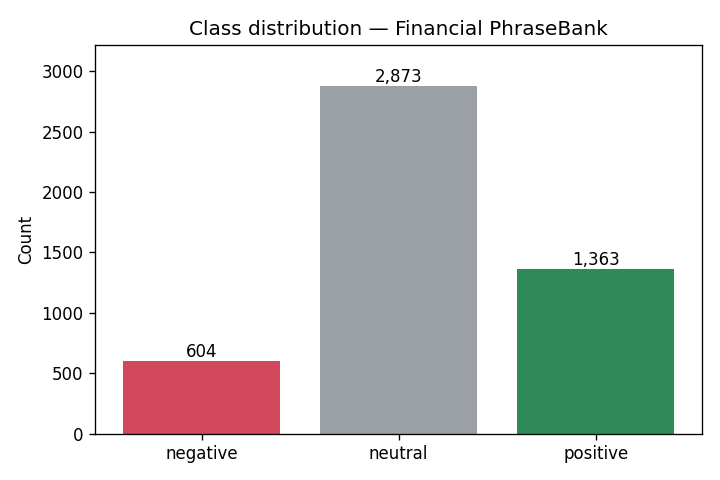
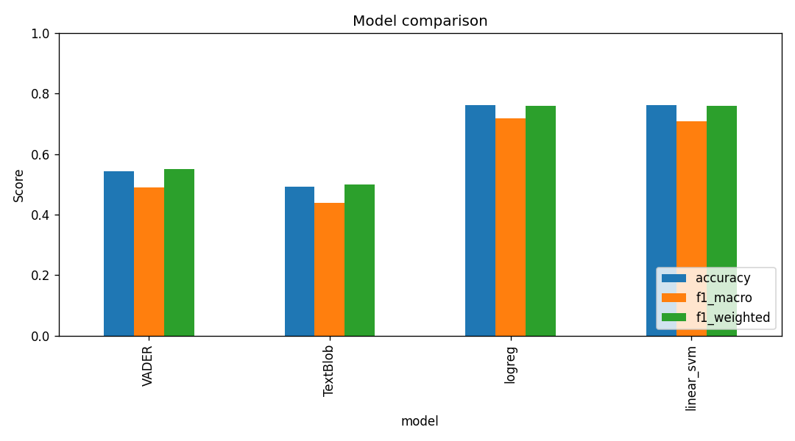
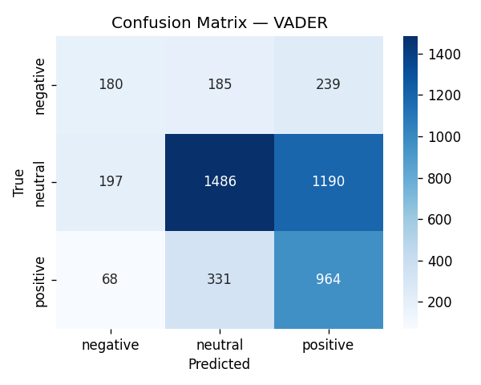
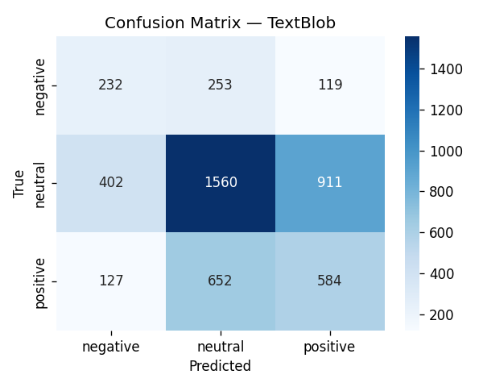
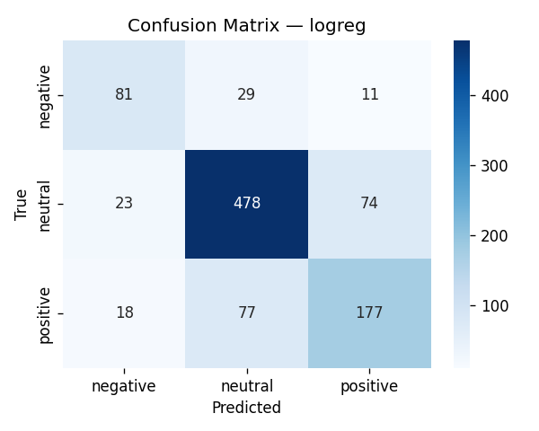
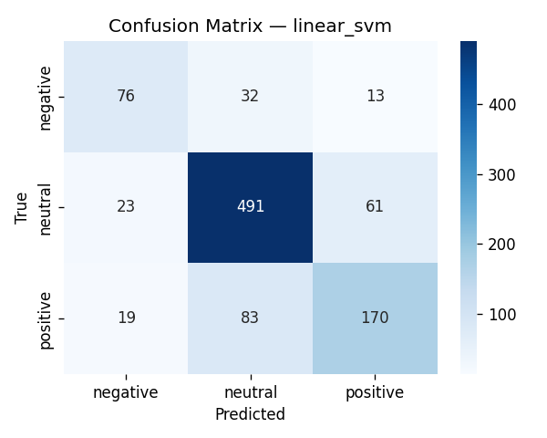
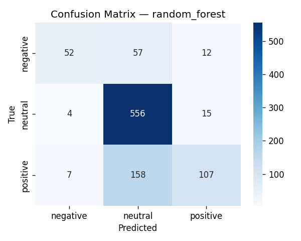

# finsent — Financial News Sentiment Pipeline

Modular, three-class (negative / neutral / positive) sentiment-classification
pipeline for financial news, built on the
[Financial PhraseBank](https://www.kaggle.com/datasets/ankurzing/sentiment-analysis-for-financial-news)
dataset (~4,840 sentences). Refactored from a single notebook into an
installable package with a CLI, config-driven experiments, persisted artifacts,
and a test suite.

## Why it is structured this way

The dataset is **neutral-heavy** (≈59% neutral, 28% positive, 12% negative), so
the design treats class imbalance and leakage as first-class concerns:



- **Lexicon baselines** (VADER, TextBlob) set a no-training reference point.
- **TF-IDF + linear / tree classifiers** wrapped in scikit-learn `Pipeline`
  objects, so the vectoriser is fit only on the training fold inside
  cross-validation — no leakage.
- **Imbalance handling** is switchable: balanced class weights (default),
  SMOTE oversampling, or none.
- **Macro-F1** is the model-selection metric (not accuracy), so the minority
  *negative* class actually counts.

## Layout

```
sentiment-finance/
├── src/finsent/
│   ├── config.py       # Config dataclass + label order / thresholds
│   ├── data.py         # load + clean Financial PhraseBank
│   ├── lexicon.py      # VADER & TextBlob baselines
│   ├── models.py       # pipeline factory, grid search, train/test split
│   ├── evaluate.py     # metrics, confusion matrices, comparison plot
│   ├── inference.py    # save/load model + predict_sentiment
│   ├── pipeline.py     # end-to-end orchestrator
│   └── cli.py          # `finsent train` / `finsent predict`
├── tests/test_finsent.py
├── data/all-data.csv   # the dataset
├── artifacts/          # saved model, metrics.json, figures (generated)
├── pyproject.toml
└── requirements.txt
```

## Install

```bash
pip install -e .            # core
pip install -e ".[dev]"     # + pytest + imbalanced-learn (for SMOTE & tests)
```

The VADER lexicon downloads automatically on first run.

## Train

```bash
# default: class_weight balancing, all 3 models, lexicon baselines, plots
finsent train --data-path data/all-data.csv

# SMOTE oversampling, skip baselines
finsent train --imbalance-strategy smote --no-lexicon

# only logistic regression, optimise weighted-F1
finsent train --models logreg --refit-metric f1_weighted
```

Outputs land in `artifacts/`: the best model (`best_sentiment_model.pkl`),
`metrics.json` (all scores + the exact config used), and PNG confusion
matrices / comparison chart.

## Predict

```bash
finsent predict \
  --text "The company reported record profits, beating expectations." \
  --text "Shares plunged after the profit warning."
```

Or from Python:

```python
from finsent import predict_sentiment
predict_sentiment(["Revenue grew on robust demand."], "artifacts/best_sentiment_model.pkl")
```

## As a library

```python
from finsent import Config, run_pipeline

cfg = Config(imbalance_strategy="smote", refit_metric="f1_macro")
out = run_pipeline(cfg)
print(out["summary"])      # metrics table
print(out["best_name"])    # selected model
```

## Indicative results

5-fold CV grid search, 80/20 stratified holdout, default balanced class weights:

| Model        | Accuracy | F1-macro | F1-neg | F1-neu | F1-pos |
|--------------|:--------:|:--------:|:------:|:------:|:------:|
| VADER        |   0.54   |   0.49   |  0.34  |  0.61  |  0.51  |
| TextBlob     |   0.49   |   0.44   |  0.34  |  0.58  |  0.39  |
| **LogReg**   | **0.76** | **0.72** |  0.67  |  0.82  |  0.66  |
| Linear SVM   |   0.76   |   0.71   |  0.64  |  0.83  |  0.66  |
| Random Forest|   0.74   |   0.64   |  0.57  |  0.83  |  0.53  |



Lexicon methods, built for social media, expectedly underperform on formal
financial language; the TF-IDF linear models close most of the gap and handle
the minority class far better. Random Forest reaches high precision on the
minority classes but poor recall — it over-predicts neutral, which the
confusion matrices below make explicit.

### Confusion matrices

| Lexicon baselines | |
|:---:|:---:|
|  |  |

| ML classifiers | |
|:---:|:---:|
|  |  |
|  | |

> Figures are regenerated into `artifacts/` on every `finsent train` run; the
> committed copies in `docs/images/` are what this README links to.

## Tests

```bash
pytest
```

## Extending

- **New model**: add a `(pipeline, param_grid)` entry in `models.build_pipelines`
  and the name to `Config.models`.
- **Transformer baseline** (e.g. FinBERT): add a module exposing the same
  `predict(texts)` interface and register it in `pipeline.run_pipeline`.
- **New dataset**: point `Config.data_path` at any two-column
  `label,text` CSV with labels in `{negative, neutral, positive}`.
