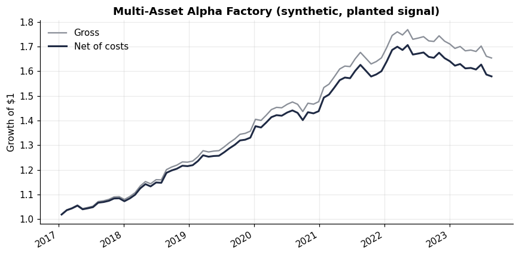
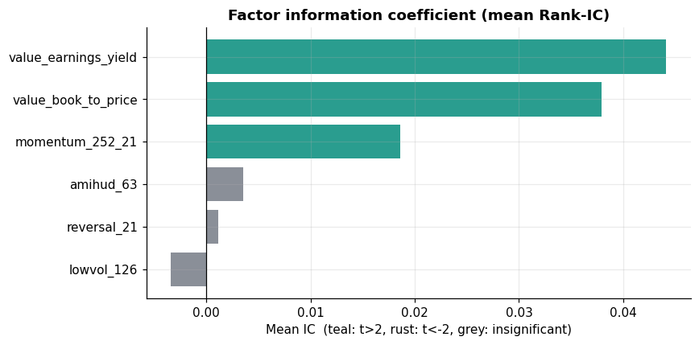
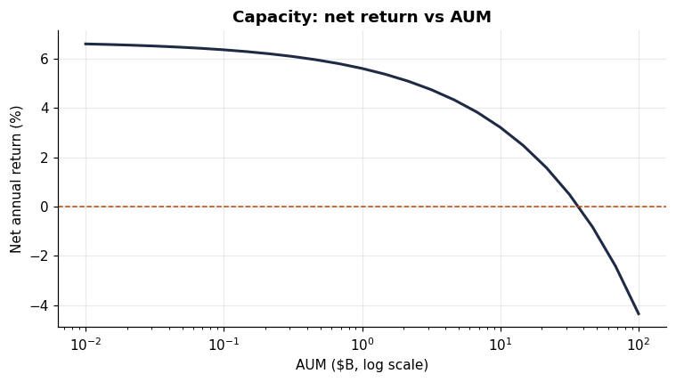
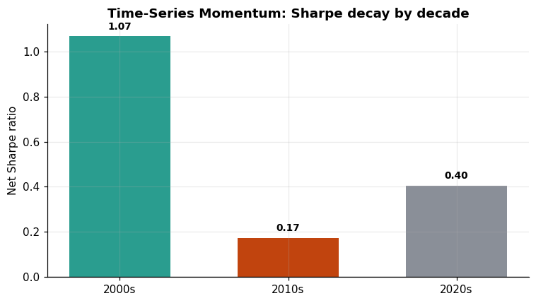

# Multi-Asset Alpha Factory


A systematic cross-sectional alpha research platform: ingest a multi-asset
panel, compute a library of factors, combine them into a tradable signal,
backtest with walk-forward discipline and realistic costs, and — crucially —
subject the result to the statistical tests that separate genuine edge from
data-mined noise.

This repository is built to demonstrate **research process**, not to publish a
live trading signal. The headline questions it answers honestly: *is the
backtest free of look-ahead and survivorship bias? Does the Sharpe survive
after costs? Does it survive correction for the number of trials? At what AUM
does the edge die?*

---

## Why this project is built the way it is

Most cross-sectional backtests overstate performance for three avoidable
reasons. This project refuses all three:

1. **Look-ahead / survivorship bias.** Fundamentals are lagged to public-
   availability dates (`PITDataLoader`, default 90-day reporting lag), the
   universe retains delisted names, and at each rebalance `t` a factor sees
   only data up to `t`. A unit test (`test_factor_only_uses_past_data`) asserts
   that a factor's output at `t` is invariant to data after `t`.

2. **Gross Sharpe theatre.** Every headline number is reported **net** of a
   transaction-cost model: half-spread, square-root market impact, and borrow
   on the short book. What matters is net Sharpe and turnover, not the gross
   curve.

3. **Multiple-testing inflation.** When you try N configs and keep the best,
   the winning Sharpe is upward-biased. The pipeline computes the **Deflated
   Sharpe Ratio** (Bailey & López de Prado) and **Probabilistic Sharpe Ratio**,
   correcting for the number of trials, skew, kurtosis, and sample length. A
   signal that does not clear DSR > 0.95 is reported as inconclusive — even
   when that is the inconvenient answer.

---

## Pipeline

```
PIT data  ->  factor library  ->  standardize / neutralize / combine
          ->  portfolio construction  ->  walk-forward backtest (net of costs)
          ->  diagnostics (perf, IC, DSR/PSR, capacity)
```

| Stage | Module | What it does |
|-------|--------|--------------|
| Data | `data/loader.py`, `data/equity.py` | PIT-lagged panel; real equity loader w/ dollar-ADV |
| Factors | `factors/library.py` | Momentum, reversal, low-vol, value, illiquidity |
| Combine | `factors/combiner.py` | Winsorize → sector-neutralize → z-score → equal/IC/ridge |
| Portfolio | `portfolio/construction.py` | Dollar-neutral quantile or rank book, position limits |
| Costs | `backtest/costs.py` | Spread + √-impact + borrow; turnover |
| Backtest | `backtest/engine.py` | Walk-forward, periodic rebalance, no look-ahead |
| Diagnostics | `diagnostics/metrics.py` | Sharpe/Sortino/Calmar, IC/IR, **DSR**, **PSR**, capacity |
| Replication | `diagnostics/tsmom_replication.py` | Critical replication of MOP (2012) TSMOM |
| Figures | `diagnostics/plots.py`, `make_figures.py` | Regenerate all charts below |

---

## Quickstart

```bash
pip install -e ".[dev,viz]"
python -m alpha_factory.pipeline       # synthetic demo with a planted signal
python -m alpha_factory.make_figures   # regenerate the figures below
pytest                                 # 19 tests
```

---

## Results

### Equity curve — synthetic demo (planted signal)

The synthetic generator embeds a weak but real cross-sectional signal so the
plumbing has something to find. Net of costs, the strategy compounds steadily
and the gross/net gap visualizes the cost drag.



### Factor IC — the plumbing works

On the synthetic data, the value factors (which carry the planted signal)
correctly surface as the highest-IC factors with significant t-stats — a
sanity check that the cross-sectional machinery is wired correctly.



### Capacity — where the edge dies

Net annual return as a function of AUM, via the square-root impact model. The
zero-crossing is the strategy's capacity (~$46B here on synthetic params).
This is the language a PM thinks in, not a raw Sharpe.



### Statistical rigor (synthetic)

```
Net Sharpe                             : 1.534
Deflated Sharpe Ratio (net)            : 0.953
Verdict                                : SURVIVES deflation (DSR > 0.95)
Estimated capacity                     : ~$46B AUM
```

> These numbers are on **synthetic data with a deliberately planted signal**;
> they demonstrate the machinery, not a tradable edge.

---

## On real equity data — the honest result

A real loader (`data/equity.py`) pulls a liquid US large-cap universe via
yfinance, derives dollar-ADV (for capacity), and caches to parquet:

```python
from alpha_factory.data.equity import EquityDataLoader
panel, dollar_adv = EquityDataLoader().load(start="2015-01-01")
```

It is explicit about its own limitation: a universe of *currently listed*
tickers is survivorship-biased, and the loader logs a warning. The architecture
accepts a point-in-time membership source (CRSP-style) unchanged, because
everything downstream consumes `PanelData`.

**Result on 51 large-caps, 2015–2024, simple price-based factors:** net Sharpe
≈ **0.12**, deflated Sharpe ≈ **0.06** — i.e. **no edge survives.** This is the
expected and instructive outcome: the synthetic demo has a planted signal, real
liquid large-caps with naive factors do not. Reporting the disappointing number
is the entire point.

---

## Critical replication study — Time-Series Momentum (MOP 2012)

[`REPLICATION_TSMOM.md`](REPLICATION_TSMOM.md) replicates Time-Series Momentum
(Moskowitz-Ooi-Pedersen 2012), stresses it with costs, and tests out-of-sample
persistence. Headline finding: a strong Sharpe in the paper-era 2000s collapses
in the 2010s — the classic post-publication decay of a heavily-cited factor.



```python
from alpha_factory.diagnostics.tsmom_replication import (
    TimeSeriesMomentum, load_tsmom_proxies,
)
res = TimeSeriesMomentum().run(load_tsmom_proxies())
print(res.by_period)
```

---

## Design choices worth defending in interview

- **Light combiner on purpose.** Equal / IC / ridge, not a deep net. Heavy ML
  on a few hundred monthly cross-sections overfits; restraint is a signal.
- **Spearman IC** — rank-based, robust to outliers and non-linearity.
- **Sector neutralization** so the signal is a within-sector bet.
- **IC weighting uses a trailing window excluding the current period**, so the
  live weighting is not contaminated by the period it predicts.

## Limitations (stated, not hidden)

- yfinance universe is survivorship-biased; real research needs PIT membership.
- The impact model is reduced-form; true capacity needs per-name ADV detail.
- Synthetic data has no regime shifts or crowding; real data is harsher.

## Roadmap

- [x] Real equity panel via yfinance with dollar-ADV + parquet cache
- [x] Critical replication of a published factor (TSMOM out-of-sample decay)
- [x] Report figures (equity curve, IC, capacity, decay)
- [ ] Point-in-time index membership (CRSP-style) for survivorship-free runs
- [ ] Per-factor orthogonalization & crowding diagnostics
- [ ] Mean-variance construction with turnover penalty as an alternative book
- [ ] Real fundamentals (Compustat-style) wired into the value factors

## License

MIT
