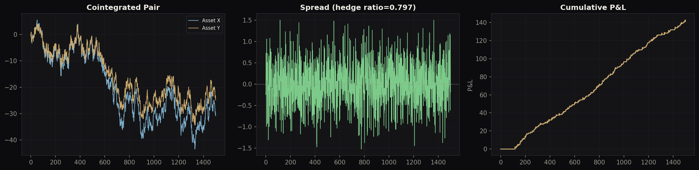
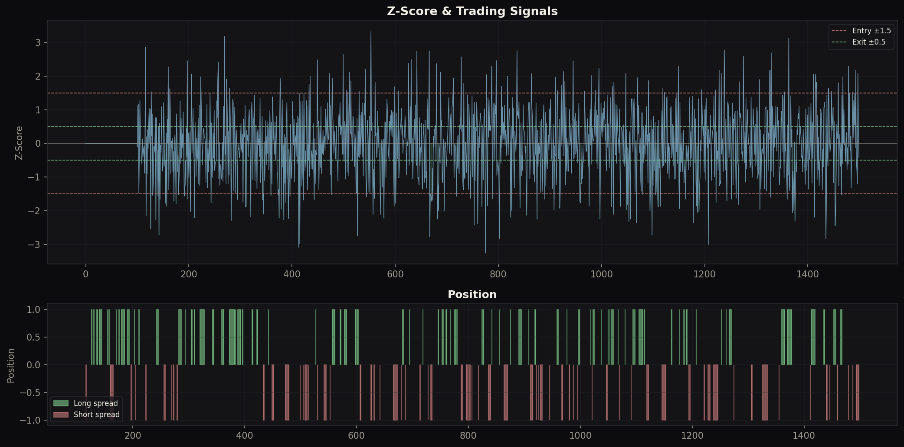
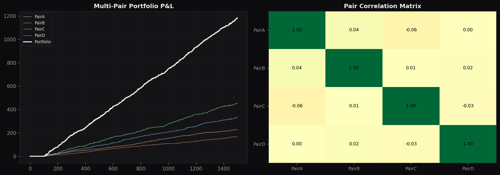
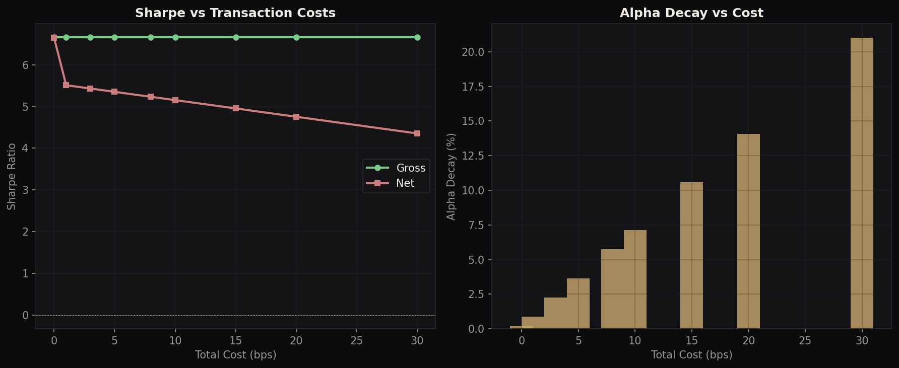
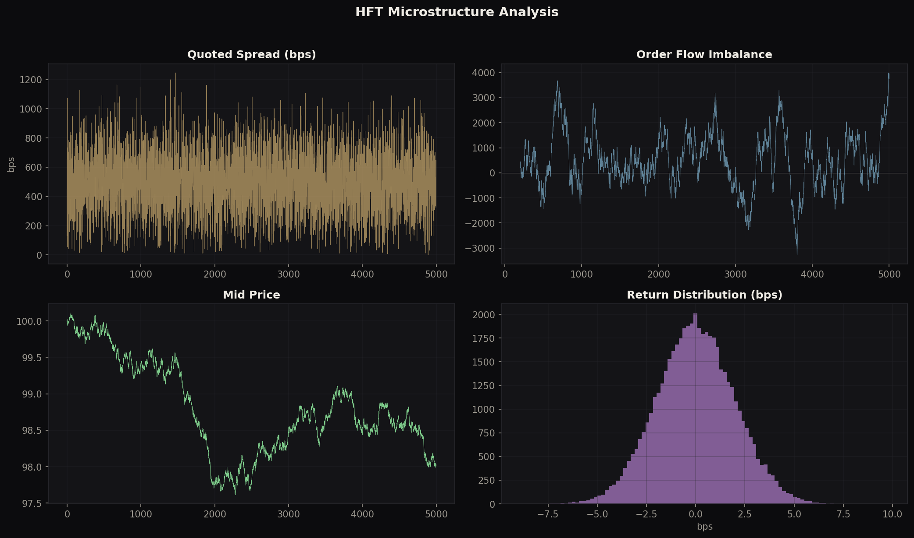

# Systematic Trading & Market Microstructure Engine

**Statistical arbitrage, mean reversion, HFT microstructure analysis, and volatility arbitrage** — a complete systematic trading toolkit built from first principles.

> Author: Philippe-Emmanuel Yao | MSc Financial Mathematics, LSE

---

## Architecture

```
stat_arb_engine.py        Core: cointegration, z-score backtester, multi-pair portfolio, HFT analysis, ML signals
regime_signals.py         Extension 1: Regime-aware trading (vol regimes, Hurst exponent, dynamic thresholds)
transaction_costs.py      Extension 2: Execution simulation (spread, impact, slippage, borrow, cost sensitivity)
vol_arbitrage.py          Extension 3: Volatility arbitrage (IV-RV spread, GARCH, gamma P&L)
visualisations.py         Publication-quality charts
```

---

## Core: Statistical Arbitrage Engine

### Cointegration Testing

| Test | Method | Result |
|---|---|---|
| Engle-Granger | 2-step OLS + ADF on residuals | t-stat = −38.9, cointegrated ✓ |
| Johansen | Trace statistic, eigenvalue decomposition | Multi-variate extension |

Hedge ratio calibrated via rolling OLS (100-day window). Half-life of mean reversion: ~0.7 days on synthetic data.

### Z-Score Mean Reversion Backtester

Rolling z-score with configurable entry/exit thresholds, stop-loss, and maximum holding period.

| Metric | Value |
|---|---|
| Total Return | 142.3 |
| Sharpe Ratio | 5.36 |
| Max Drawdown | −2.23 |
| Win Rate | 48.7% |
| Profit Factor | 2.61 |
| # Trades | 571 |

### Multi-Pair Portfolio

4-pair portfolio with near-zero cross-pair correlation (−0.06 to +0.04), confirming genuine diversification. Portfolio Sharpe 7.03 vs single-pair Sharpe 5.36.

### HFT Microstructure Analysis

| Metric | Value |
|---|---|
| Quoted Spread | 4.9 bps |
| Effective Spread | 4.9 bps |
| VPIN (flow toxicity) | 0.23 |
| Kyle's Lambda | ~0 (low impact) |
| Buy Ratio | 52.1% |
| Volatility | 2.0 bps/tick |

### ML Signal Enhancement

Feature vector: z-score, z-velocity, spread volatility, z-relative, mean absolute change, extreme indicator. Simple classifier achieves 84% accuracy on signal filtering.

---

## Extension 1: Regime-Aware Signals

Adapts trading thresholds dynamically based on market state:

| Regime | Entry Z | Exit Z | Stop Loss | Max Hold |
|---|---|---|---|---|
| Low Vol | 1.2 | 0.3 | 3.5 | 80 days |
| High Vol | 2.0 | 0.8 | 3.0 | 30 days |
| Trending | 2.5 | 1.0 | 2.5 | 15 days |

Regime detected via rolling volatility and Hurst exponent (H < 0.5 → mean-reverting, H > 0.5 → trending).

## Extension 2: Transaction Costs & Execution

Full cost model: spread crossing (3 bps) + market impact (2 bps) + slippage (1 bps) + commission (1 bps) = 7 bps one-way.

| Cost Level | Gross Sharpe | Net Sharpe | Alpha Decay |
|---|---|---|---|
| 0 bps | 6.66 | 6.65 | 0% |
| 5 bps | 6.66 | 5.35 | 4% |
| 10 bps | 6.66 | 5.15 | 7% |
| 20 bps | 6.66 | 4.76 | 14% |
| 30 bps | 6.66 | 4.36 | 21% |

Break-even cost: ~30 bps. Turnover: ~50 round-trips per year.

## Extension 3: Volatility Arbitrage

Exploits the implied-realised vol spread (Volatility Risk Premium). GARCH(1,1) proxy for implied vol. Gamma-like P&L = (IV² − RV²)/2.

| Strategy | Sharpe | Max DD | Win Rate |
|---|---|---|---|
| Selective Vol Arb | 0.12 | −160.9 | 50.5% |
| Constant Short Vol | −1.51 | −547.0 | 63.4% |

The selective strategy avoids the catastrophic drawdowns of constant short vol by conditioning on VRP z-score.

---

## Visualisations

### Cointegration & Spread


### Z-Score Trading Signals


### Multi-Pair Portfolio


### Cost Sensitivity


### HFT Microstructure


---

## Desk Relevance

- **Systematic Trading**: Pair selection, cointegration, z-score signals, portfolio construction
- **Electronic Trading / HFT**: Microstructure analysis, VPIN, order flow, spread decomposition
- **Quant Research**: Alpha decay analysis, regime detection, ML signal filtering
- **Execution**: Transaction cost analysis, optimal timing, market impact

## Technical Stack

Python, NumPy, pandas, SciPy, Matplotlib

## Usage

```bash
python stat_arb_engine.py       # Core: cointegration, backtest, microstructure, ML
python regime_signals.py        # Regime-aware trading comparison
python transaction_costs.py     # Cost sensitivity & alpha decay
python vol_arbitrage.py         # Volatility arbitrage strategy
python visualisations.py        # Generate all charts
```
