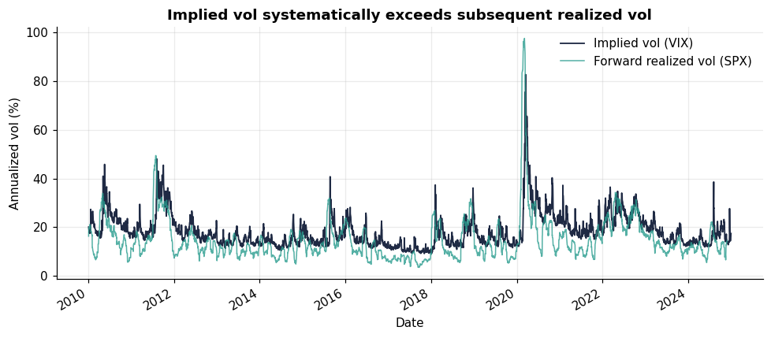
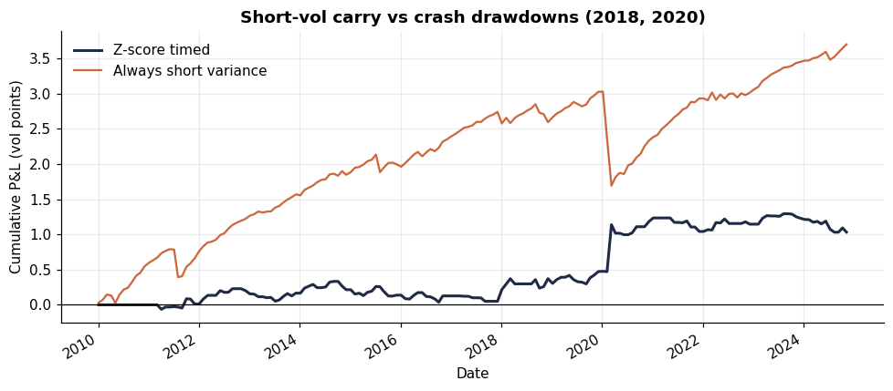
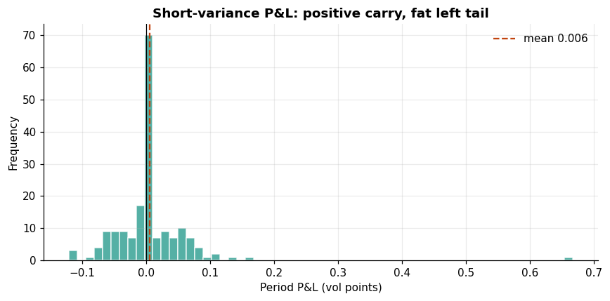
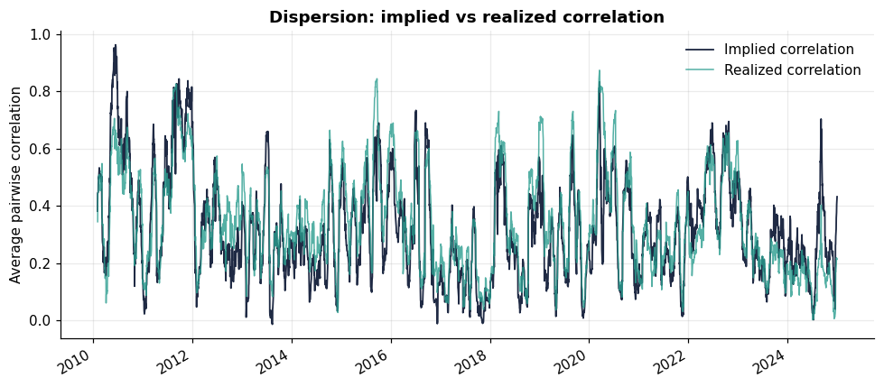

# Volatility Arbitrage — Variance Risk Premium & Dispersion


Two classic volatility-arbitrage strategies on **real market data**: harvesting
the **variance risk premium** (selling rich index implied vol against realized)
and a **dispersion** trade (index implied vs realized correlation). The focus is
on measuring the premium honestly and showing its **crash-risk asymmetry**,
not on a headline Sharpe.

---

## What this fixes versus a naive vol-arb backtest

A common pitfall (and the starting point this project was rebuilt from) is to
*synthesise* implied vol as `realized_vol + noise`, then "trade" the IV−RV
spread. That is circular: the spread is the noise you just added, so the P&L is
mechanically positive and proves nothing. This rebuild corrects four things:

1. **Implied vol is observed, not fabricated** — sourced from the VIX (and VXN),
   so IV−RV is a real, measurable premium.
2. **No look-ahead in the signal** — the position at *t* uses only implied vol
   and *trailing* realized vol. Forward realized vol is the settlement
   *outcome*, never an input to the decision. (A unit test enforces the z-score
   has no same-bar peek.)
3. **Correct, normalized P&L** — a delta-hedged variance position settled in
   *vol points* (vega convention), so a vol spike doesn't make the series
   uninterpretable. Short variance correctly **loses** in a vol spike — also a
   unit test.
4. **Costs and the real risk profile** — transaction costs in vol points, plus
   skew / CVaR / crash-drawdown reporting.

---

## Results (SPX/VIX, 2010–2024)

### The premium is real

Implied vol exceeded subsequently-realized vol on **83.5% of days**, averaging a
**3.67 vol-point** premium (VIX mean 18.4% vs forward realized 14.7%). This is
the variance risk premium — compensation for bearing variance/crash risk.



### …but it is a short-crash-risk premium, not free money

The honest story is the asymmetry. An always-short-variance book earns steady
carry, then gets cut in vol spikes (Feb 2018, Mar 2020 ≈ −5.8 vol points in a
month). A z-score-timed overlay gives up carry to sidestep the worst of the
drawdown.

| Metric (non-overlapping monthly) | Z-score timed | Always short |
|---|---:|---:|
| Sharpe | 0.30 | 0.76 |
| Skew | +5.7 | **−5.1** |
| Max drawdown (vol pts) | −0.30 | **−1.34** |
| CVaR 95% | −0.09 | −0.29 |



The negative skew and fat left tail of the short book are the point — a
candidate who reports only the Sharpe has missed what makes short-vol dangerous.



### Dispersion: implied vs realized correlation

Index variance decomposes into constituent variances plus cross-covariances, so
index IV implies an average correlation. Comparing implied (≈0.32) to realized
(≈0.34) average correlation gives the dispersion signal (short index vol / long
single-name vol when implied correlation is rich).



> Dispersion here uses a constituent-IV *proxy* (trailing realized scaled by the
> index premium ratio) because single-name option histories aren't freely
> available. The implied-vs-realized correlation *relationship* is the object of
> study; the architecture accepts true single-name IV unchanged. This limitation
> is stated, not hidden.

---

## Pipeline

| Stage | Module | What it does |
|---|---|---|
| Data | `data/loader.py` | VIX/VXN + SPX/NDX + constituent basket; trailing & forward RV |
| Signals | `signals/vrp.py` | Variance risk premium; implied/realized correlation; lagged z-score |
| Strategy | `strategy/backtest.py` | Vega-normalized variance P&L; dispersion P&L; costs |
| Diagnostics | `diagnostics/metrics.py` | Sharpe/Sortino, skew/kurtosis, VaR/CVaR, crash profile |

## Quickstart

```bash
pip install -e ".[dev,viz,data]"
python -m vol_arb.pipeline         # full VRP + dispersion report
python -m vol_arb.make_figures     # regenerate the figures above
pytest                             # 9 tests
```

The repo ships with cached parquet data, so it runs offline out of the box.

## Design choices worth defending in interview

- **Trailing RV for the signal, forward RV for settlement** — the single most
  important separation; conflating them is the classic circular-backtest bug.
- **Vega-convention P&L** rather than raw variance points, so 2020 doesn't
  dominate every statistic through one observation.
- **Always-short benchmark** alongside the timed strategy, to expose the raw
  premium and its crash profile rather than hide behind a timing overlay.
- **Non-overlapping sampling** for performance stats, since overlapping
  21-day windows autocorrelate and inflate the Sharpe.

## Limitations (stated, not hidden)

- VIX is a 30-day constant-maturity proxy, not a traded variance swap; real
  execution would use the swap or a replicating option strip.
- Dispersion uses a constituent-IV proxy (see note above).
- No term-structure / skew dimension yet — a natural extension.

## Roadmap

- [x] Observed IV (VIX), real VRP, no-look-ahead signal, vega-normalized P&L
- [x] Always-short vs timed crash-profile comparison
- [x] Dispersion via implied vs realized correlation
- [ ] True single-name implied vol for dispersion (option-chain history)
- [ ] Variance-swap replication strip instead of VIX proxy
- [ ] Vol term-structure and skew signals

## License

MIT
