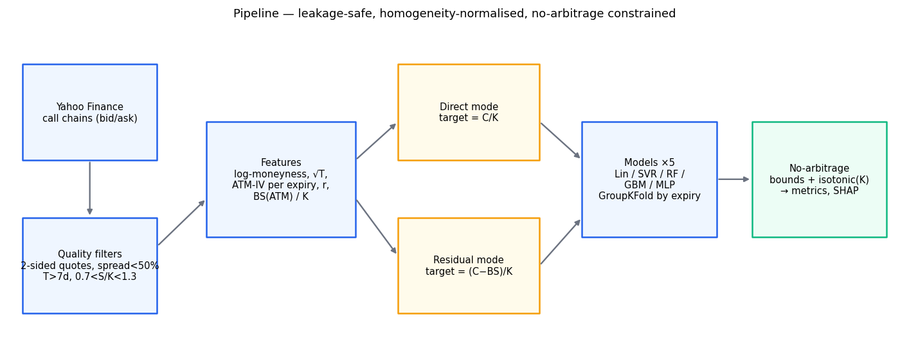
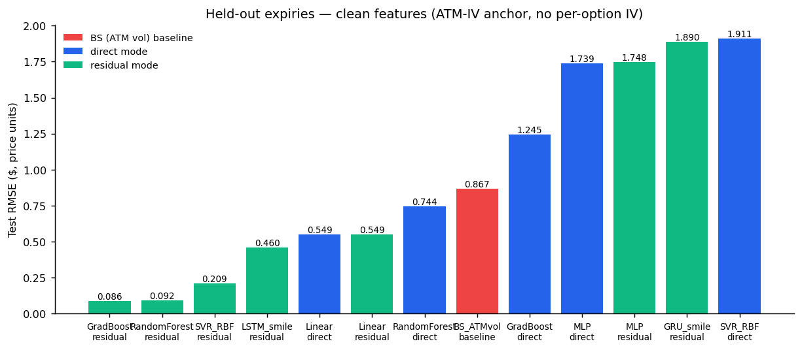
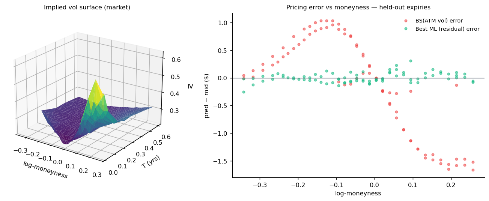
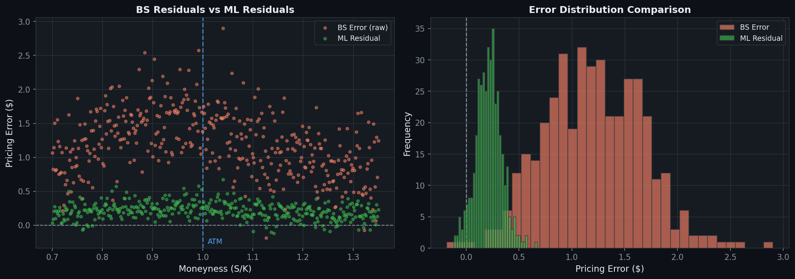
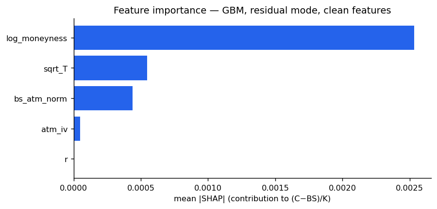
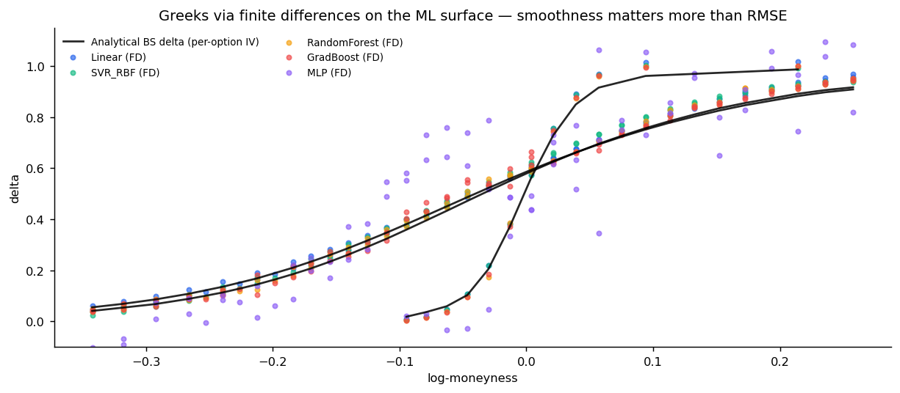

# Machine Learning for Option Pricing


> **Focus:** ML correction of Black-Scholes mispricing · Greeks approximation vs analytical · Monte Carlo benchmark · LSTM/GRU smile-as-sequence · leakage-safe validation · no-arbitrage constraints
> **Relevant for:** Quantitative Research, Equity Vol Desks, Model Validation, Electronic Trading

---

## Overview

This project benchmarks machine learning models for pricing equity call options on live market data, with one central thesis: **ML should correct Black-Scholes, not replace it**. Two modes are compared end-to-end:

1. **Direct pricing** — map observable inputs to market prices.
2. **Residual correction** — learn the *systematic mispricing* of a Black-Scholes anchor, i.e. the smile, and add the correction back: `price = BS(ATM vol) + ML(features)`.

The framework is deliberately strict about three methodological traps that plague most "ML for option pricing" projects, and quantifies each one rather than ignoring it.

---

## Pipeline



---

## Methodology — the three traps, and how they are handled

### 1. IV circularity

Per-option implied volatility is *computed from the price*. Feeding it back as a feature to predict the price is near-circular: the model only needs to invert Black-Scholes. Instead, the **clean feature set uses the per-expiry ATM implied vol** as a smile-level anchor — the model must learn the skew and curvature itself. A *circular* feature set (per-option IV) is kept for comparison, so the gap is measured, not assumed:

| Mode | Clean (ATM-IV) | Circular (per-option IV) |
|---|---|---|
| GradBoost residual, RMSE ($) | **0.086** | 0.207 |
| RandomForest residual, RMSE ($) | **0.092** | 0.262 |

The clean setup actually *wins* in residual mode: per-option IV adds bid-ask noise, while the ATM anchor plus moneyness structure is what generalises across expiries.

### 2. Leakage through splitting and scaling

Options from the same expiry share one smile snapshot — a random row split leaks the smile from train to test. The split here holds out **entire expiries** (`GroupShuffleSplit`), and cross-validation is `GroupKFold` by expiry: the cross-sectional analogue of walk-forward validation. `StandardScaler` lives only inside sklearn `Pipeline`s (refit within each fold) and only for scale-sensitive models (Linear, SVR, MLP). **Tree models receive raw features** — they are invariant to monotone transforms, so scaling them is pure pipeline risk for zero benefit.

### 3. Target scale bias

Standardising the raw price as a target mixes incomparable scales: a $0.05 OTM call and an $80 ITM call. MSE then rewards models that nail ITM prices while being terrible *in relative terms* on OTM — exactly where the smile matters. The fix exploits Black-Scholes homogeneity of degree one, `C(S, K) = K · c(S/K, T, σ, r)`: the target is the **strike-normalised midpoint `C/K`** (never standardised), and the label is the **bid-ask midpoint**, not `lastPrice` (which carries stale-trade and bid-ask noise).

---

## Data

- **Source:** Yahoo Finance (`yfinance`) — live AAPL call chains, 16 expiries fetched
- **Filters:** two-sided live quotes, relative spread < 50%, T > 7 days, 0.7 < S/K < 1.3
- **Sample (run of 2026-06-12):** 332 options · train 251 / 9 expiries · test 79 / 3 held-out expiries

| Feature | Description | Role |
|---|---|---|
| `log_moneyness` | log(S/K) | smile dimension to learn |
| `sqrt_T` | √(time to maturity) | term-structure dimension |
| `atm_iv` | per-expiry ATM implied vol | smile-level anchor (non-circular) |
| `r` | risk-free rate | discounting |
| `bs_atm_norm` | BS(ATM vol) / K | baseline anchor (residual mode) |
| `iv` *(circular set only)* | per-option implied vol | circularity benchmark |

**Target:** `mid / K` (direct mode) or `(mid − BS_atm) / K` (residual mode).

---

## Models

| Model | Implementation | Scaling | Notes |
|---|---|---|---|
| **Black-Scholes (ATM vol)** | analytical baseline | — | the bar to beat |
| **Monte Carlo (GBM)** | antithetic variates, 100k paths | — | engine benchmark |
| Linear Regression | sklearn Pipeline | StandardScaler (in-fold) | sanity floor |
| SVR (RBF) | sklearn Pipeline + GroupKFold grid | StandardScaler (in-fold) | C, γ tuned |
| Random Forest | sklearn, 400 trees | none (raw) | min_samples_leaf=3 |
| Gradient Boosting | HistGradientBoostingRegressor | none (raw) | lr=0.06, depth 6, L2=1.0 |
| MLP | sklearn Pipeline, 256→128→64 | StandardScaler (in-fold) | early stopping |
| LSTM / GRU | PyTorch, bidirectional 2×64 | train-stats z-score | **smile-as-sequence** (below) |

### LSTM / GRU — recurrence done honestly

A naive LSTM over randomly ordered option rows is meaningless: one chain snapshot is cross-sectional, not a time series. The reformulation here treats **each expiry's smile as a sequence ordered by strike**: neighbouring strikes are strongly coupled (smile smoothness, butterfly no-arbitrage), so a bidirectional recurrent pass along the strike axis exploits local smile structure that pointwise models ignore. Each expiry is one padded sequence; the network emits one residual prediction per option (seq2seq, masked MSE), with early stopping on a held-out train expiry.

---

## Results — live AAPL run, held-out expiries



| Model | Mode | RMSE ($) | R² | Median rel. err ATM | Calendar viol. |
|---|---|---|---|---|---|
| **GradBoost** | **residual [clean]** | **0.086** | **0.99999** | **0.39%** | **0.0%** |
| RandomForest | residual [clean] | 0.092 | 0.99999 | 0.48% | 0.0% |
| SVR (RBF) | residual [clean] | 0.209 | 0.99995 | 0.60% | 0.0% |
| **LSTM (smile-seq)** | residual [clean] | 0.460 | 0.99975 | 1.83% | 0.0% |
| Linear | direct [clean] | 0.549 | 0.99961 | 1.68% | 0.0% |
| **BS (ATM vol)** | **baseline** | **0.867** | **0.99877** | **1.81%** | 0.0% |
| **Monte Carlo (ATM vol)** | **baseline** | **0.886** | — | — | — |
| GradBoost | direct [clean] | 1.245 | 0.99696 | 3.02% | 2.3% |
| MLP | direct [clean] | 1.739 | 0.99649 | 7.16% | 11.4% |
| GRU (smile-seq) | residual [clean] | 1.890 | 0.99552 | 2.29% | 13.6% |

Full table in [`results.csv`](results.csv). Four findings:

1. **Residual mode dominates everywhere.** The best residual model cuts RMSE by **90% vs the BS baseline** (0.086 vs 0.867). The ML model only has to learn the smile correction — a small, structured target — instead of the full price map.
2. **Direct mode can be *worse* than Black-Scholes.** Direct GBM (1.245) and MLP (1.739) underperform the analytical baseline on held-out expiries: tree extrapolation and unconstrained networks fail outside the training smile. This is the strongest argument for anchored architectures.
3. **Recurrence helps, but data-hungrily.** The strike-sequence LSTM (0.460) beats every direct model, the MLP and the linear baseline — local smile structure is real signal — but loses to gradient boosting on 251 training options. The GRU underfits and generates calendar arbitrage; with a single snapshot, recurrent capacity is not yet paid for. This is the honest version of "LSTM for option pricing".
4. **Neural networks generate arbitrage.** Direct MLP violates calendar-spread monotonicity on 11.4% of strike-matched pairs before post-processing; tree-based residual models violate none. No-arbitrage constraints are not optional for unconstrained function approximators.

### Volatility surface & pricing error



> Left: the market implied-vol surface (smile + term structure). Right: BS(ATM) errors show the classic smirk signature — systematic, asymmetric in moneyness — while the residual-mode ML errors are flat around zero across the full strike range.

### Black-Scholes residuals — before and after



> Left: BS(ATM) mispricing *is* the smile — negative on the put-wing-equivalent (low strikes priced with flat vol), positive ITM, with clear maturity dependence. Right: the residual distribution collapses from a bimodal ±$1.6 spread to a tight peak at zero after ML correction.

---

## SHAP Interpretability



| Feature | SHAP rank | Interpretation |
|---|---|---|
| `log_moneyness` | 1st | the smile — exactly what residual mode is supposed to learn |
| `sqrt_T` | 2nd | term structure of the correction |
| `bs_atm_norm` | 3rd | anchor level (correction scales with price) |
| `atm_iv` | 4th | vol-level dependence of skew |
| `r` | 5th | negligible at short maturities, as expected |

The ranking is the economic signature of a smile model: moneyness dominates *because the target is the BS residual*. If `bs_atm_norm` dominated instead, the model would merely be re-learning the anchor — a useful diagnostic for overfitting to the baseline.

---

## Greeks — finite differences on the ML surface

Any fitted model defines a pricing surface; **delta and vega are extracted by central finite differences**, bumping spot (±0.5%) and ATM vol (±50bp) and rebuilding all spot-dependent features (log-moneyness, BS anchor). The benchmark is the analytical BS greeks at the per-option implied vol — the market-standard greeks.



| Model (residual mode) | Delta MAE | Vega MAE | Delta ∈ [0, 1] |
|---|---|---|---|
| **RandomForest** | **0.017** | 4.39 | 100% |
| GradBoost | 0.021 | **3.46** | 100% |
| Linear | 0.022 | 4.37 | 97.5% |
| SVR (RBF) | 0.024 | 10.23 | 100% |
| MLP | 0.123 | 244.1 | 82.3% |

Two structural insights:

- **The residual architecture inherits smooth greeks from the anchor.** Differentiating `BS(ATM) + K·ML(x)` means the analytical BS delta provides the smooth backbone; the ML term only perturbs it. This is why even *tree* models — whose raw surfaces are piecewise-constant — deliver delta MAE ≈ 0.02 here. A direct-mode tree would produce step-function deltas.
- **A poorly-fit network is a risk hazard, not just a pricing one.** The MLP's vega MAE of 244 and out-of-range deltas (18% outside [0,1]) show that price RMSE understates the damage: unconstrained approximators corrupt *sensitivities* faster than *levels*. For hedging, surface smoothness is the binding requirement.

---

## Monte Carlo benchmark

A GBM terminal-value Monte Carlo pricer (antithetic variates, 100,000 paths) is run on the test set at the ATM vol — under flat vol it must converge to BS(ATM), which validates the engine: max |MC − BS| = $0.159 with mean standard error $0.087, fully consistent.

| Engine | RMSE vs market mid ($) | Runtime, 79 options |
|---|---|---|
| Monte Carlo (ATM vol, 100k paths) | 0.886 | 1,880 ms |
| Black-Scholes analytic (ATM vol) | 0.867 | 0.5 ms |
| **ML residual (GradBoost)** | **0.086** | **7.6 ms** |

The point of the comparison: MC and analytic BS agree (same flat-vol model, so same smile-shaped error vs the market), while the ML correction prices the *actual smile* at **~250× the speed of Monte Carlo**. This is the standard industrial motivation for ML pricing approximators — replacing slow numerical engines in risk loops (XVA, scenario revaluation) where millions of repricings are needed — demonstrated here on the simplest possible case.

---

## No-Arbitrage Constraints

Post-processing applied to every prediction:

```python
# Intrinsic lower bound and spot upper bound
price = np.clip(price, np.maximum(S - K*np.exp(-r*T), 0.0), S)

# Monotonicity in strike (call spread no-arbitrage):
# isotonic regression per expiry, decreasing in K
IsotonicRegression(increasing=False).fit_transform(K_sorted, price_sorted)

# Calendar-spread monotonicity is *measured* (violation rate reported
# per model) rather than silently enforced — see results table.
```

---

## Limitations & next steps

| Limitation | Impact | Fix |
|---|---|---|
| GRU underfits on one snapshot | recurrent capacity unpaid-for | multi-snapshot panel training |
| Single snapshot (one fetch date) | no temporal generalisation test | daily collection → true walk-forward |
| Single underlying (AAPL) | idiosyncratic smile patterns | multi-asset panel |
| Constant risk-free rate | minor at T < 1y | OIS curve bootstrap |
| Isotonic post-processing in K only | calendar arbitrage measured, not enforced | surface-aware loss (SSVI penalty) |
| ATM-IV still derived from prices | weaker but nonzero circularity | GARCH/realised-vol forecast as vol input |

---

## Structure & usage

```
ML-for-option-pricing/
├── ml_option_pricing.py     # core pipeline (data → models → metrics → figures)
├── deep_models.py           # LSTM / GRU — smile-as-sequence (PyTorch)
├── greeks_mc.py             # FD greeks on ML surfaces + Monte Carlo benchmark
├── plots.py                 # figure generation
├── results.csv              # full results table (live run)
├── greeks.csv               # greeks accuracy table (live run)
├── requirements.txt
├── images/                  # all figures, regenerated on each run
└── README.md
```

```bash
pip install -r requirements.txt
python ml_option_pricing.py --ticker AAPL      # live run + figures
python ml_option_pricing.py --synthetic --fast # offline smoke test (SVI-like smile)
```

The `--synthetic` mode generates an SVI-like smile with bid-ask noise and known ground truth — useful for validating that the pipeline itself (splits, scaling, constraints) is leakage-free before touching market data.

---

## Tech Stack

`Python 3.10+` · `NumPy` · `pandas` · `scikit-learn` · `PyTorch` · `SciPy` · `SHAP` · `yfinance` · `Matplotlib`

---

*Part of the [Quantitative Finance Personal Projects](https://github.com/philippeyao123/PERSONAL-PROJECTS) repository.*
