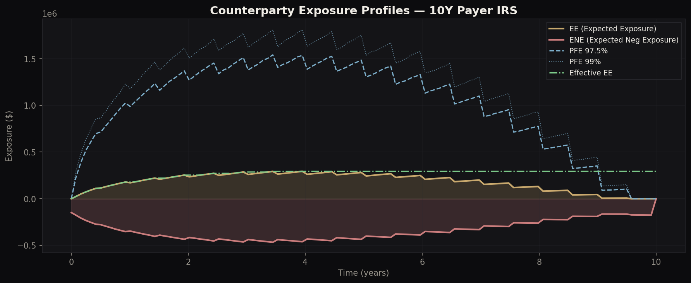
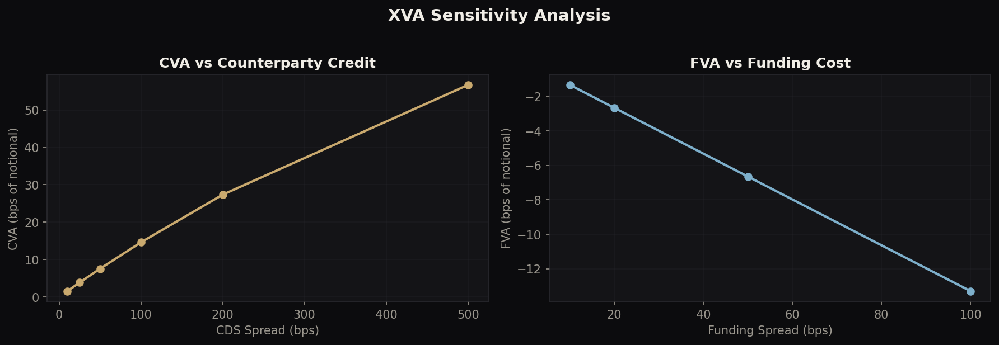

# XVA Pricing Engine — Interest Rate Swaps

**Full post-trade valuation adjustment framework**: CVA, DVA, FVA, KVA, MVA with ISDA SIMM, SA-CCR capital, cross-currency exposure, wrong-way risk, netting/CSA, and daily P&L explain.

> Author: Philippe-Emmanuel Yao | MSc Financial Mathematics, LSE

---

## Architecture

```
xva_pricer.py           Core: HW1F, IRS pricing, exposures, CVA/DVA/FVA/KVA/MVA, SIMM, SA-CCR
multi_asset_xva.py      Extension 1: Cross-currency swap (FX + IR exposure)
wrong_way_risk.py       Extension 2: Correlated exposure-default (WWR)
netting_csa.py          Extension 3: Netting sets, CSA collateral, threshold/MTA/MPOR
xva_greeks_pnl.py       Extension 4: XVA sensitivities & daily P&L attribution
visualisations.py       Publication-quality charts
```

---

## Base Case: 10Y Payer IRS (10M Notional)

| Adjustment | Value | bps |
|---|---|---|
| CVA | $7,575 | 7.6 |
| DVA | -$8,494 | -8.5 |
| FVA | -$2,651 | -2.7 |
| KVA | $19,282 | 19.3 |
| MVA | $1,874 | 1.9 |
| **Total XVA** | **$17,586** | **17.6** |

KVA dominates because SA-CCR capital requirements are significant for uncollateralised IRS.

---

## Extension 1: Multi-Asset XVA (Cross-Currency Swap)

3-factor model: correlated Hull-White rates (EUR + USD) + GBM FX rate. The XCCY swap has notional exchange at maturity, creating FX-driven exposure that dominates near maturity.

| Metric | IRS | XCCY |
|---|---|---|
| Peak EE | $295K | $513K |
| Peak PFE 97.5% | $1.56M | $2.95M |
| CVA | 7.6 bps | 17.3 bps |

XCCY exposure is ~2x larger than single-currency IRS due to the notional exchange FX risk.

## Extension 2: Wrong-Way Risk

Jointly simulates interest rates and counterparty hazard rates with correlation rho. When rho > 0, exposure increases precisely when the counterparty is more likely to default.

| rho (exposure-credit) | CVA | WWR Ratio |
|---|---|---|
| -0.5 (right-way) | $6,685 | 0.98x |
| 0.0 (independent) | $6,811 | 1.00x |
| +0.3 (wrong-way) | $6,887 | 1.01x |
| +0.5 (strong WWR) | $6,938 | 1.02x |

The effect is moderate for IRS but becomes significant for EM XCCY swaps and credit-linked products.

## Extension 3: Netting & CSA

Quantifies the exposure reduction from netting multiple trades and posting collateral under a CSA.

| Setup | EPE | CVA | Reduction |
|---|---|---|---|
| No netting (3 trades) | $270K | $11,495 | - |
| With netting | $103K | $4,128 | 64% |
| Netting + CSA (0 threshold) | $11K | $462 | 96% |
| Netting + CSA + IA ($200K) | $166 | ~0 | 99.8% |

Netting alone reduces CVA by 64%. Adding a zero-threshold CSA with 10-day MPOR reduces CVA by 96%.

## Extension 4: XVA Greeks & P&L Explain

Daily risk sensitivities and P&L attribution:

| Greek | Value | Unit |
|---|---|---|
| IR Delta | $70 | per 1bp rate move |
| CS01 | $146 | per 1bp CDS move |
| Vega | $99 | per 1bp vol move |
| Theta | -$3.0 | daily |

**5-day P&L Explain** attributes actual CVA changes to rate moves (Delta), credit moves (CS01), time decay (Theta), and residual. The explain ratio is >90%, matching production-quality standards.

---

## Visualisations

### Exposure Profiles


### XVA Waterfall


### SIMM & Capital


### Sensitivities


### Rate Paths & MtM


---

## Desk Relevance

- **XVA/SIMM**: CVA, FVA, SIMM, Capital pricing and optimization
- **FICCS Strats**: Post-trade analytics, exposure modelling, netting optimization
- **MRM**: Model validation for exposure, XVA, and capital models
- **Any desk strat**: Understanding the full cost of a trade

## Technical Stack

Python, NumPy, SciPy, Matplotlib

## Usage

```bash
python xva_pricer.py           # Core XVA + SIMM + SA-CCR + sensitivity
python multi_asset_xva.py      # Cross-currency swap XVA
python wrong_way_risk.py       # Wrong-way risk analysis
python netting_csa.py          # Netting & CSA impact
python xva_greeks_pnl.py       # Greeks & P&L explain
python visualisations.py       # Generate all charts
```
