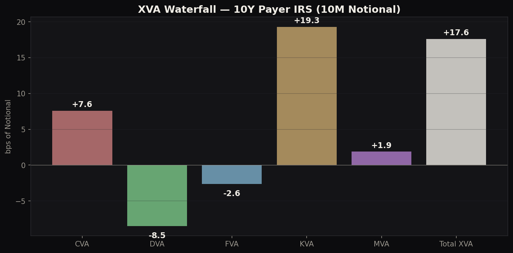
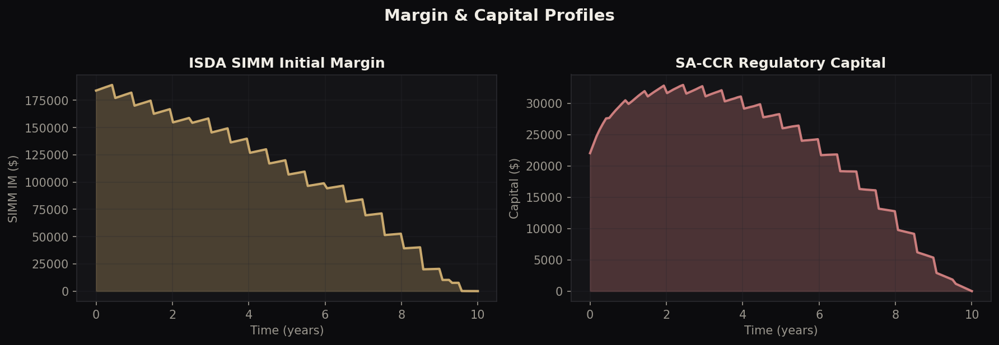
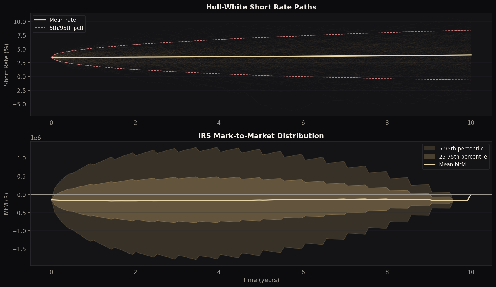

# XVA Pricing Engine — Interest Rate Swaps

**Full post-trade valuation adjustment framework**: CVA, DVA, FVA, KVA, MVA with ISDA SIMM and SA-CCR regulatory capital on vanilla IRS.

> Author: Philippe-Emmanuel Yao | MSc Financial Mathematics, LSE

---

## What is XVA?

After 2008, derivatives pricing moved beyond risk-free valuation. The "XVA" framework captures the real costs of trading:

| Adjustment | What it captures | Who cares |
|---|---|---|
| **CVA** | Counterparty default risk | Credit risk, trading desk |
| **DVA** | Own default benefit | Treasury, accounting |
| **FVA** | Cost of funding uncollateralised exposure | Treasury, trading desk |
| **KVA** | Cost of holding regulatory capital | Capital management |
| **MVA** | Cost of posting initial margin (SIMM) | Margin desk, treasury |

Total XVA on a 10Y, 10M notional payer IRS: **17.6 bps** (dominated by KVA at 19.3 bps).

---

## Architecture

```
xva_pricer.py        Full engine: HW1F, IRS pricing, exposures, XVA, SIMM, SA-CCR
visualisations.py    Publication-quality charts
```

### Pipeline

1. **Hull-White 1F** simulates 100K short rate paths
2. **IRS valuation** at each future time step via affine bond pricing
3. **Exposure profiles**: EE, ENE, EPE, Effective EPE, PFE (97.5%, 99%)
4. **ISDA SIMM**: DV01-based initial margin using SIMM risk weights
5. **SA-CCR**: Regulatory capital (EAD, RWA, capital requirement)
6. **XVA calculation**: CVA, DVA, FVA, KVA, MVA with sensitivity analysis

---

## Results

### Exposure Profiles


Peak EE at ~3Y reflects the "hump-shaped" exposure profile characteristic of IRS: uncertainty grows with time but remaining cash flows shrink.

### XVA Waterfall


KVA dominates (19.3 bps) because SA-CCR capital requirements are significant for uncollateralised IRS. CVA (7.6 bps) is partially offset by DVA (-8.5 bps). FVA is negative (-2.6 bps) because the swap has negative expected MtM (payer at-the-money).

### SIMM & Capital


### Rate Paths & MtM Distribution


### XVA Sensitivities


CVA scales approximately linearly with CDS spread. FVA scales linearly with funding spread.

---

## Key Results

| Metric | Value |
|---|---|
| CVA | 7.6 bps |
| DVA | -8.5 bps |
| FVA | -2.6 bps |
| KVA | 19.3 bps |
| MVA | 1.9 bps |
| **Total XVA** | **17.6 bps** |
| Peak EE | $295K |
| Peak PFE 97.5% | $1.56M |
| Peak SIMM IM | $189K |
| Peak Capital | $33K |

### CVA by Credit Quality

| CDS Spread | CVA (bps) |
|---|---|
| 10 bps (AAA) | 1.6 |
| 50 bps (A) | 7.6 |
| 100 bps (BBB) | 14.7 |
| 200 bps (BB) | 27.5 |
| 500 bps (B) | 56.9 |

---

## Desk Relevance

- **UBS XVA/SIMM**: Exactly the role described — CVA, FVA, SIMM, Capital pricing
- **GS FICCS Strats**: Post-trade analytics, exposure modelling, capital optimisation
- **JPM MRM**: Model risk for exposure and XVA models
- **Any desk strat**: Understanding the true cost of a trade beyond mid-market pricing

## Technical Stack

Python, NumPy, SciPy, Matplotlib

## Usage

```bash
python xva_pricer.py         # Full pricing + SIMM + capital + sensitivity
python visualisations.py     # Generate all charts
```
